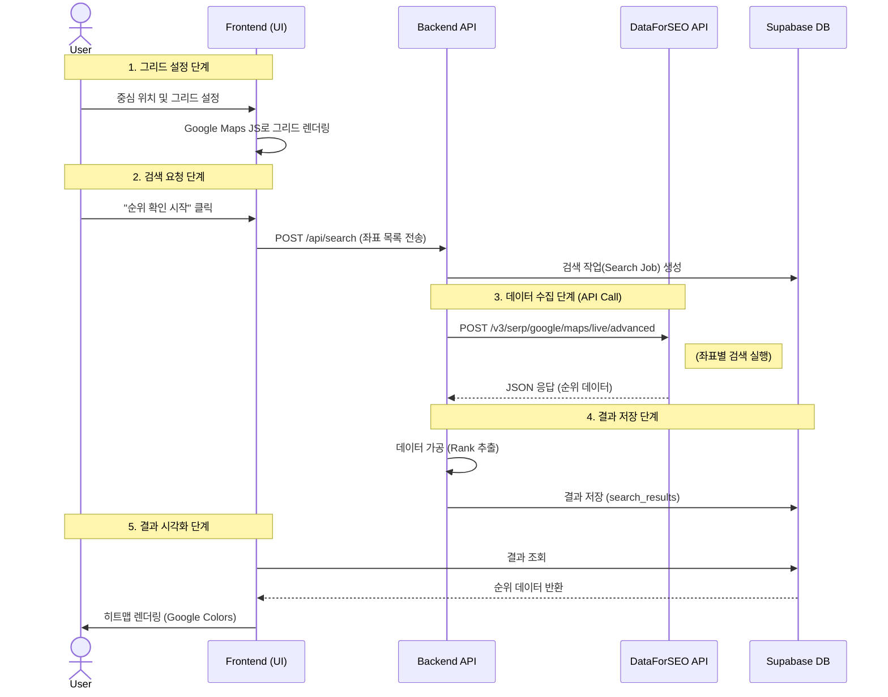

# Google Grid Heatmap System Architecture

이 문서는 현재 구현된 구글 지도 그리드 순위 추적 시스템의 아키텍처, 데이터 흐름, 파일 구조 및 핵심 로직을 설명합니다.

---

## 1. System Architecture

이 시스템은 **API 통합(Integration) 모델**을 따르며, UI는 구글 지도를 사용하고 데이터는 서드파티(DataForSEO) API를 통해 수집합니다.

```mermaid
graph TD
    subgraph "Frontend (Client)"
        UI_Grid[Grid Configurator<br/>(GridConfigurator)]
        UI_Heatmap[Heatmap Visualizer<br/>(RankHeatmap)]
        User[User]
    end

    subgraph "Backend (Next.js Server)"
        API_Route[API Route<br/>/api/search]
        Data_Client[DataForSEO Client<br/>(lib/dataforseo)]
    end

    subgraph "Database (Supabase)"
        DB[(PostgreSQL)]
    end

    subgraph "External Services"
        Google_Maps[Google Maps JS API<br/>(Maps & Grid UI)]
        DataForSEO[DataForSEO API<br/>(SERP Data Provider)]
    end

    %% Connections
    User -->|Configures Grid| UI_Grid
    UI_Grid -->|Uses API Key| Google_Maps
    UI_Grid -->|POST request| API_Route
    
    API_Route -->|Requests Data| Data_Client
    Data_Client -->|API Call (Live/Postback)| DataForSEO
    
    DataForSEO -->>|Returns Rank Data| Data_Client
    Data_Client -->|Saves Results| DB
    UI_Heatmap -->|Fetches Data| DB
    User -->|Views Results| UI_Heatmap
```

---

## 2. Data Flow (Sequence Diagram)

구글 버전은 외부 API를 호출하므로 스크래퍼보다 구조가 단순하고 빠릅니다.



---

## 3. Directory & File Structure

```bash
src/
├── app/
│   ├── api/
│   │   ├── search/                  # [API] 구글 검색 요청 및 처리
│   │   │   ├── route.ts             # POST (검색 생성)
│   │   │   ├── [id]/route.ts        # GET (단일 결과 조회)
│   │   │   └── all/route.ts         # GET (전체 목록)
│   └── dashboard/
│       ├── new/                     # [Page] 구글 검색 설정 (그리드)
│       └── [id]/                    # [Page] 구글 검색 결과 (히트맵)
│
├── components/
│   ├── search/
│   │   ├── GridConfigurator.tsx     # [UI] 그리드 포인트 설정 (Google Map)
│   │   └── PlaceSearchInput.tsx     # [UI] 장소 검색 (Autocomplete)
│   ├── results/
│   │   └── RankHeatmap.tsx          # [UI] 구글용 히트맵 시각화
│   └── maps/
│       └── GoogleMapsProvider.tsx   # [Wrapper] @react-google-maps/api 래퍼
│
├── lib/
│   ├── dataforseo/
│   │   ├── client.ts                # [Client] DataForSEO API 호출 로직
│   │   └── types.ts                 # [Type] API 요청/응답 타입
│   └── utils/
│       └── grid.ts                  # [Util] 그리드 좌표 계산 함수
│
└── types/
    └── index.ts                     # 공용 타입 정의
```

---

## 4. Key Logic (Pseudo-code)

### A. Frontend: Grid Calculation (WGS84)
`src/lib/utils/grid.ts`

```typescript
FUNCTION CALCULATE_GOOGLE_GRID(center, distance, size):
    # 구글 지도는 WGS84 좌표계를 사용함
    # 위도 1도 ≈ 111km 가정하에 근사값 계산
    
    points = []
    FOR row, col IN grid:
        lat = center.lat + (row * distance / 111.32)
        lng = center.lng + (col * distance / (111.32 * cos(lat)))
        points.ADD({ lat, lng })
        
    RETURN points
```

### B. Backend: DataForSEO Integration
`src/lib/dataforseo/client.ts`

```typescript
FUNCTION FETCH_GOOGLE_RANKS(tasks):
    # DataForSEO API에 보낼 페이로드 구성
    post_body = []
    FOR task IN tasks:
        post_body.ADD({
            location_coordinate: task.lat + "," + task.lng,
            keyword: task.keyword,
            language_code: "ko",
            type: "google_maps_search"
        })
        
    # API 요청 (Batch)
    RESPONSE = HTTP.POST("https://api.dataforseo.com/...", post_body)
    
    # 결과 파싱
    parsed_results = []
    FOR item IN RESPONSE.tasks:
        rank = FIND_RANK(item.result_items, target_business_name)
        parsed_results.ADD({ lat, lng, rank })
        
    RETURN parsed_results
```
