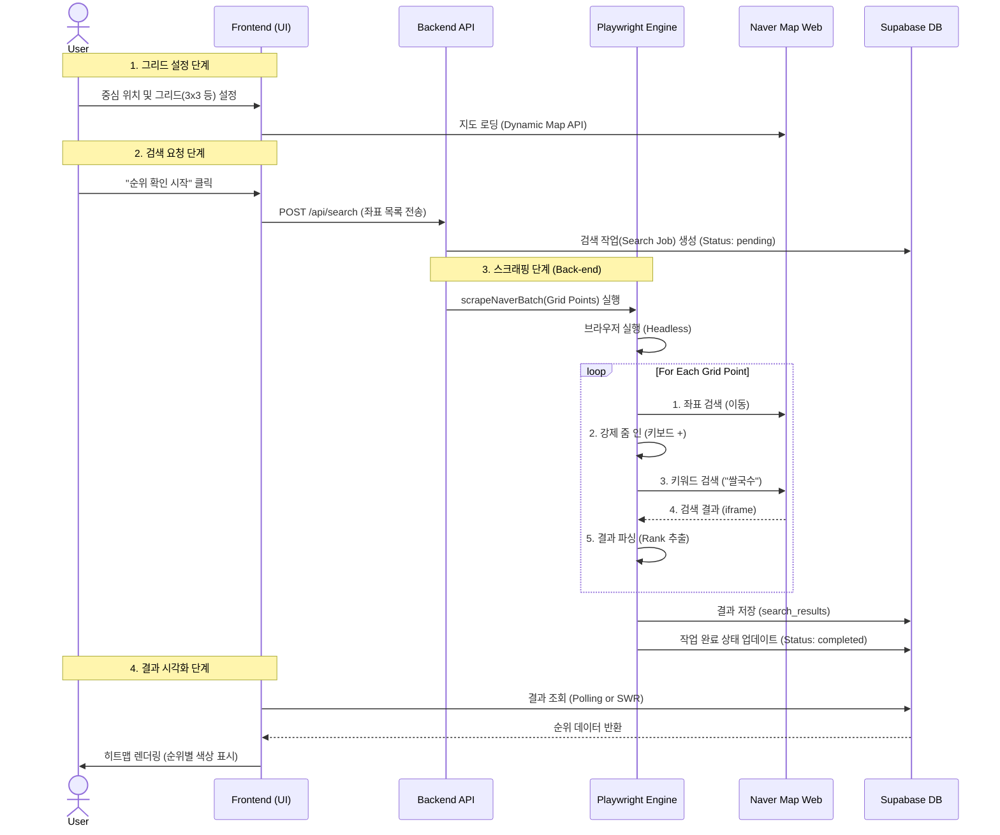

# Naver Grid Heatmap System Architecture

이 문서는 현재 구현된 네이버 지도 그리드 순위 추적 시스템의 아키텍처, 데이터 흐름, 파일 구조 및 핵심 로직을 설명합니다.

---

## 1. System Architecture

이 시스템은 **API 기반 UI**와 **브라우저 기반 스크래퍼**가 결합된 하이브리드 구조입니다.

```mermaid
graph TD
    subgraph "Frontend (Client)"
        UI_Grid[Grid Configurator<br/>(NaverMapGridConfigurator)]
        UI_Heatmap[Heatmap Visualizer<br/>(NaverRankHeatmap)]
        User[User]
    end

    subgraph "Backend (Next.js Server)"
        API_Route[API Route<br/>/api/naver/places/search]
        Scraper_Engine[Scraper Engine<br/>Playwright (Headless Chrome)]
    end

    subgraph "Database (Supabase)"
        DB[(PostgreSQL)]
    end

    subgraph "External Services"
        Naver_API[Naver Maps JS API<br/>(Dynamic Map)]
        Naver_Web[Naver Map Website<br/>(map.naver.com)]
    end

    %% Connections
    User -->|Configures Grid| UI_Grid
    UI_Grid -->|Uses API Key| Naver_API
    UI_Grid -->|POST request| API_Route
    
    API_Route -->|Triggers| Scraper_Engine
    Scraper_Engine -->|Visits & Scrapes| Naver_Web
    
    Scraper_Engine -->|Saves Results| DB
    UI_Heatmap -->|Fetches Data| DB
    User -->|Views Results| UI_Heatmap
```

---

## 2. Data Flow (Sequence Diagram)

사용자가 검색을 요청하고 결과를 확인하기까지의 데이터 흐름입니다.



---

## 3. Directory & File Structure

핵심 파일들의 위치와 역할입니다.

```bash
src/
├── app/
│   ├── api/
│   │   └── naver/
│   │       ├── search/              # 검색 작업 생성/조회 API
│   │       └── places/search/       # (구현 예정) 실시간 프록시 등
│   └── naver-search/
│       ├── new/                     # [Page] 검색 설정 (그리드 지정)
│       └── [id]/                    # [Page] 검색 결과 (히트맵)
│
├── components/
│   └── naver/
│       ├── NaverMapGridConfigurator.tsx  # [UI] 그리드 포인트 설정 컴포넌트
│       ├── NaverRankHeatmap.tsx          # [UI] 결과 시각화 컴포넌트
│       └── NaverMap.tsx                  # [Wrapper] react-naver-maps 래퍼
│
├── lib/
│   └── naver/
│       ├── scraper.ts               # [Core] Playwright 스크래퍼 로직 (v4.0)
│       ├── config.ts                # [Config] 스크래퍼 설정 (타임아웃 등)
│       └── types.ts                 # [Type] 데이터 타입 정의
│
└── types/
    └── naver.ts                     # 전역 네이버 타입 (DB 스키마 등)
```

---

## 4. Key Logic (Pseudo-code)

### A. Frontend: Grid Calculation
`NaverMapGridConfigurator.tsx`에서 그리드 좌표를 계산하는 로직입니다.

```typescript
FUNCTION CALCULATE_GRID(centerLat, centerLng, distanceKm, gridSize):
    points = []
    degreePerKm_Lat = 1 / 111.32
    degreePerKm_Lng = 1 / (111.32 * COS(centerLat))
    
    FOR row FROM -half TO half:
        FOR col FROM -half TO half:
            lat = centerLat + (row * distanceKm * degreePerKm_Lat)
            lng = centerLng + (col * distanceKm * degreePerKm_Lng)
            points.PUSH({ lat, lng })
    
    RETURN points
```

### B. Backend: Scraper Strategy (v4.0)
`scraper.ts`에 구현된 "지도 이동 및 재귀적 줌 인" 전략입니다.

```typescript
FUNCTION SCRAPE_NAVER_MAP(lat, lng, keyword):
    # 1. 브라우저로 네이버 지도 PC 버전 접속
    page.GOTO('map.naver.com')
    
    # 2. 좌표 검색으로 지도 이동
    INPUT.FILL(lat + "," + lng)
    INPUT.PRESS("Enter")
    WAIT(2000)
    
    # 3. [핵심] 강제 줌 인 (Zoom Reset 방지)
    # 마우스 휠 대신 키보드 '+'를 사용하여 정확히 중앙 확대
    REPEAT 6 TIMES:
        KEYBOARD.PRESS("+")
        WAIT(200)
        
    # 4. 검색창 초기화
    INPUT.CLEAR()
    
    # 5. 키워드 검색 (현 지도에서 검색 유도)
    INPUT.FILL(keyword)
    INPUT.PRESS("Enter")
    
    # 6. iframe 결과 파싱
    FRAME = GET_FRAME('searchIframe')
    RESULTS = FRAME.EXTRACT_LIST()
    
    RETURN RESULTS
```
