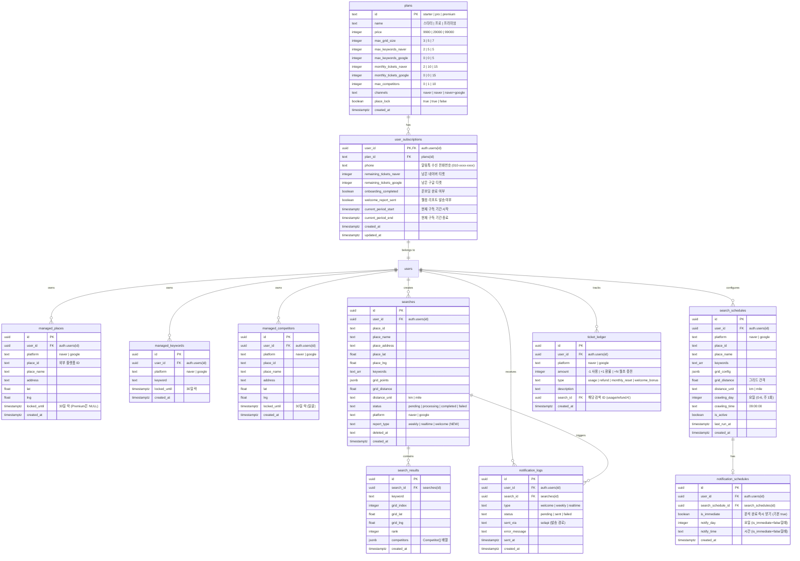

# 맵타민 ERD 설계 (v2.2 — 솔라피 연동)

> **Date**: 2026-02-13 (v2.2 솔라피/전화번호 반영)  
> **기반**: update_plan.md, user_flow_design.md, 기존 마이그레이션 001~014

---

## 1. 전체 ERD (Mermaid)



---

## 2. 기존 테이블 처리 방침

### ✅ 유지 (구조 보존, 컬럼 추가만)

| 테이블 | 변경 사항 |
|--------|----------|
| `searches` | `report_type TEXT DEFAULT 'realtime'` 컬럼 추가 |
| `search_results` | 변경 없음 (그대로 유지) |

### 🔄 수정 (구조 변경)

| 테이블 | 변경 사항 |
|--------|----------|
| `plans` | 컬럼 전면 재설계: `monthly_points` → 삭제, 티켓/키워드/경쟁사 관련 컬럼 추가 |
| `user_credits` → **`user_subscriptions`** | 테이블명 변경 + 구조 전면 변경: 포인트 → 티켓 |
| `managed_places` | UNIQUE 제약 조건 복원: `(user_id, platform, place_id)` → `(user_id, platform)` |
| `managed_competitors` | `locked_until` 컬럼 이미 존재, 일괄 락 로직은 앱단에서 처리 |
| `search_schedules` | `crawling_days INT[]` → `crawling_day INT` + `grid_distance`, `distance_unit` 추가 |
| `credit_ledger` → **`ticket_ledger`** | 테이블명 변경 + 포인트 → 티켓, platform 컬럼 추가 |

### ➕ 신규 생성

| 테이블 | 용도 |
|--------|------|
| `managed_keywords` | 관리 키워드 (30일 락) |
| `notification_schedules` | 카톡 수신 스케줄 (검색 스케줄과 분리) |
| `notification_logs` | 알림톡 발송 이력 |

### 🗑️ 삭제 고려

| 테이블 | 사유 |
|--------|------|
| `daily_usage` | 티켓 시스템으로 대체됨 (ticket_ledger가 이력 담당) |

---

## 3. 테이블별 상세 설계

### 3-1. `plans` (요금제 — 기존 테이블 ALTER)

```sql
-- 현재 컬럼: id, name, monthly_points, max_grid_size, limits, created_at
-- 변경: monthly_points 삭제, limits(jsonb) 삭제 → 명시적 컬럼으로 전환

ALTER TABLE plans
  ADD COLUMN IF NOT EXISTS price INTEGER NOT NULL DEFAULT 0,
  ADD COLUMN IF NOT EXISTS max_keywords_naver INTEGER NOT NULL DEFAULT 2,
  ADD COLUMN IF NOT EXISTS max_keywords_google INTEGER NOT NULL DEFAULT 0,
  ADD COLUMN IF NOT EXISTS monthly_tickets_naver INTEGER NOT NULL DEFAULT 2,
  ADD COLUMN IF NOT EXISTS monthly_tickets_google INTEGER NOT NULL DEFAULT 0,
  ADD COLUMN IF NOT EXISTS max_competitors INTEGER NOT NULL DEFAULT 0,
  ADD COLUMN IF NOT EXISTS channels TEXT NOT NULL DEFAULT 'naver',
  ADD COLUMN IF NOT EXISTS place_lock BOOLEAN NOT NULL DEFAULT true;

-- Seed Data (기존 light/basic/pro → starter/pro/premium)
DELETE FROM plans WHERE id IN ('light', 'basic');

INSERT INTO plans (id, name, price, max_grid_size, max_keywords_naver, max_keywords_google, monthly_tickets_naver, monthly_tickets_google, max_competitors, channels, place_lock)
VALUES
  ('starter', '스타터 (Starter)', 9900, 3, 2, 0, 2, 0, 0, 'naver', true),
  ('pro', '프로 (Pro)', 29000, 5, 5, 0, 10, 0, 1, 'naver', true),
  ('premium', '프리미엄 (Premium)', 99000, 7, 5, 5, 15, 15, 10, 'naver+google', false)
ON CONFLICT (id) DO UPDATE SET
  name = EXCLUDED.name,
  price = EXCLUDED.price,
  max_grid_size = EXCLUDED.max_grid_size,
  max_keywords_naver = EXCLUDED.max_keywords_naver,
  max_keywords_google = EXCLUDED.max_keywords_google,
  monthly_tickets_naver = EXCLUDED.monthly_tickets_naver,
  monthly_tickets_google = EXCLUDED.monthly_tickets_google,
  max_competitors = EXCLUDED.max_competitors,
  channels = EXCLUDED.channels,
  place_lock = EXCLUDED.place_lock;
```

### 3-2. `user_subscriptions` (구독 — user_credits 대체)

```sql
-- user_credits 테이블을 user_subscriptions로 대체
-- 기존 user_credits는 trigger(014)에서 참조하므로, 새 테이블 생성 후 trigger 교체

CREATE TABLE IF NOT EXISTS user_subscriptions (
  user_id UUID PRIMARY KEY REFERENCES auth.users(id) ON DELETE CASCADE,
  plan_id TEXT REFERENCES plans(id) DEFAULT 'starter',
  phone TEXT,  -- 알림톡 수신 전화번호 (온보딩 시 수집, 형식: 01012345678)
  remaining_tickets_naver INTEGER NOT NULL DEFAULT 0,
  remaining_tickets_google INTEGER NOT NULL DEFAULT 0,
  onboarding_completed BOOLEAN NOT NULL DEFAULT false,
  welcome_report_sent BOOLEAN NOT NULL DEFAULT false,
  current_period_start TIMESTAMPTZ DEFAULT NOW(),
  current_period_end TIMESTAMPTZ DEFAULT NOW() + INTERVAL '30 days',
  created_at TIMESTAMPTZ DEFAULT NOW(),
  updated_at TIMESTAMPTZ DEFAULT NOW()
);
```

### 3-3. `managed_keywords` (신규)

```sql
CREATE TABLE managed_keywords (
  id UUID PRIMARY KEY DEFAULT gen_random_uuid(),
  user_id UUID NOT NULL REFERENCES auth.users(id) ON DELETE CASCADE,
  platform TEXT NOT NULL CHECK (platform IN ('naver', 'google')),
  keyword TEXT NOT NULL,
  locked_until TIMESTAMPTZ NOT NULL DEFAULT NOW() + INTERVAL '30 days',
  created_at TIMESTAMPTZ DEFAULT NOW(),
  UNIQUE(user_id, platform, keyword)
);

ALTER TABLE managed_keywords ENABLE ROW LEVEL SECURITY;

CREATE POLICY "Users manage own keywords"
  ON managed_keywords USING (auth.uid() = user_id);
```

### 3-4. `managed_places` UNIQUE 제약 조건 복원

```sql
-- 012에서 UNIQUE(user_id, platform, place_id)로 변경되었으나,
-- 비즈니스 규칙은 "플랫폼당 1곳"이므로 UNIQUE(user_id, platform)으로 복원
DO $$
BEGIN
  IF EXISTS (
    SELECT 1 FROM pg_constraint
    WHERE conname = 'managed_places_user_id_platform_place_id_key'
  ) THEN
    ALTER TABLE managed_places
    DROP CONSTRAINT managed_places_user_id_platform_place_id_key;
  END IF;

  IF NOT EXISTS (
    SELECT 1 FROM pg_constraint
    WHERE conname = 'managed_places_user_id_platform_key'
  ) THEN
    -- 중복 데이터가 있으면 먼저 정리 필요
    ALTER TABLE managed_places
    ADD CONSTRAINT managed_places_user_id_platform_key UNIQUE (user_id, platform);
  END IF;
END $$;
```

### 3-5. `searches` (기존 — 컬럼 추가만)

```sql
-- report_type 컬럼 추가 (weekly/realtime/welcome 구분)
ALTER TABLE searches
  ADD COLUMN IF NOT EXISTS report_type TEXT DEFAULT 'realtime'
  CHECK (report_type IN ('weekly', 'realtime', 'welcome'));
```

### 3-6. `search_schedules` (기존 — 컬럼 변경)

```sql
-- crawling_days INT[] → crawling_day INT (주 1회로 변경)
-- grid_distance, distance_unit 추가
DO $$
BEGIN
  -- 1. crawling_day 단일 컬럼 추가
  IF NOT EXISTS (
    SELECT 1 FROM information_schema.columns
    WHERE table_name = 'search_schedules' AND column_name = 'crawling_day'
  ) THEN
    ALTER TABLE search_schedules ADD COLUMN crawling_day INTEGER;
    -- 기존 배열의 첫 번째 값을 마이그레이션
    UPDATE search_schedules SET crawling_day = crawling_days[1]
    WHERE crawling_days IS NOT NULL AND array_length(crawling_days, 1) > 0;
  END IF;

  -- 2. grid_distance 추가
  IF NOT EXISTS (
    SELECT 1 FROM information_schema.columns
    WHERE table_name = 'search_schedules' AND column_name = 'grid_distance'
  ) THEN
    ALTER TABLE search_schedules ADD COLUMN grid_distance DECIMAL DEFAULT 0.5;
  END IF;

  -- 3. distance_unit 추가
  IF NOT EXISTS (
    SELECT 1 FROM information_schema.columns
    WHERE table_name = 'search_schedules' AND column_name = 'distance_unit'
  ) THEN
    ALTER TABLE search_schedules ADD COLUMN distance_unit TEXT DEFAULT 'km';
  END IF;
END $$;
```

### 3-7. `notification_schedules` (신규)

```sql
CREATE TABLE notification_schedules (
  id UUID PRIMARY KEY DEFAULT gen_random_uuid(),
  user_id UUID NOT NULL REFERENCES auth.users(id) ON DELETE CASCADE,
  search_schedule_id UUID REFERENCES search_schedules(id) ON DELETE CASCADE,
  is_immediate BOOLEAN NOT NULL DEFAULT true,
  notify_day INTEGER CHECK (notify_day BETWEEN 0 AND 6),
  notify_time TIME,
  created_at TIMESTAMPTZ DEFAULT NOW(),
  UNIQUE(user_id, search_schedule_id)
);

ALTER TABLE notification_schedules ENABLE ROW LEVEL SECURITY;

CREATE POLICY "Users manage own notification schedules"
  ON notification_schedules USING (auth.uid() = user_id);
```

### 3-8. `notification_logs` (신규)

```sql
CREATE TABLE notification_logs (
  id UUID PRIMARY KEY DEFAULT gen_random_uuid(),
  user_id UUID NOT NULL REFERENCES auth.users(id) ON DELETE CASCADE,
  search_id UUID REFERENCES searches(id) ON DELETE SET NULL,
  type TEXT NOT NULL CHECK (type IN ('welcome', 'weekly', 'realtime')),
  status TEXT NOT NULL DEFAULT 'pending' CHECK (status IN ('pending', 'sent', 'failed')),
  sent_via TEXT NOT NULL DEFAULT 'solapi',  -- 발송 경로 (향후 대행사 변경 시 추적용)
  error_message TEXT,
  sent_at TIMESTAMPTZ,
  created_at TIMESTAMPTZ DEFAULT NOW()
);

ALTER TABLE notification_logs ENABLE ROW LEVEL SECURITY;

CREATE POLICY "Users view own notifications"
  ON notification_logs FOR SELECT USING (auth.uid() = user_id);
```

### 3-9. `ticket_ledger` (credit_ledger 대체)

```sql
CREATE TABLE ticket_ledger (
  id UUID PRIMARY KEY DEFAULT gen_random_uuid(),
  user_id UUID NOT NULL REFERENCES auth.users(id) ON DELETE CASCADE,
  platform TEXT NOT NULL CHECK (platform IN ('naver', 'google')),
  amount INTEGER NOT NULL, -- -1: 사용, +1: 환불, +N: 충전
  type TEXT NOT NULL CHECK (type IN ('usage', 'refund', 'monthly_reset', 'welcome_bonus')),
  description TEXT,
  search_id UUID REFERENCES searches(id) ON DELETE SET NULL,
  created_at TIMESTAMPTZ DEFAULT NOW()
);

ALTER TABLE ticket_ledger ENABLE ROW LEVEL SECURITY;

CREATE POLICY "Users view own ticket history"
  ON ticket_ledger FOR SELECT USING (auth.uid() = user_id);
```

---

## 4. 핵심 RPC 함수

### 4-1. `deduct_ticket` (티켓 차감 — deduct_points 대체)

```sql
CREATE OR REPLACE FUNCTION deduct_ticket(p_platform TEXT)
RETURNS BOOLEAN
LANGUAGE plpgsql SECURITY DEFINER AS $$
DECLARE
  v_user_id UUID;
  v_remaining INTEGER;
BEGIN
  v_user_id := auth.uid();

  IF p_platform = 'naver' THEN
    SELECT remaining_tickets_naver INTO v_remaining
    FROM user_subscriptions WHERE user_id = v_user_id FOR UPDATE;
    
    IF v_remaining <= 0 THEN
      RAISE EXCEPTION 'No remaining naver tickets';
    END IF;
    
    UPDATE user_subscriptions
    SET remaining_tickets_naver = remaining_tickets_naver - 1, updated_at = NOW()
    WHERE user_id = v_user_id;
  ELSIF p_platform = 'google' THEN
    SELECT remaining_tickets_google INTO v_remaining
    FROM user_subscriptions WHERE user_id = v_user_id FOR UPDATE;
    
    IF v_remaining <= 0 THEN
      RAISE EXCEPTION 'No remaining google tickets';
    END IF;
    
    UPDATE user_subscriptions
    SET remaining_tickets_google = remaining_tickets_google - 1, updated_at = NOW()
    WHERE user_id = v_user_id;
  ELSE
    RAISE EXCEPTION 'Invalid platform: %', p_platform;
  END IF;

  -- 이력 기록
  INSERT INTO ticket_ledger (user_id, platform, amount, type, description)
  VALUES (v_user_id, p_platform, -1, 'usage', 'Real-time diagnosis');

  RETURN TRUE;
END;
$$;
```

### 4-2. `refund_ticket` (티켓 환불 — refund_points 대체)

```sql
CREATE OR REPLACE FUNCTION refund_ticket(p_platform TEXT, p_search_id UUID DEFAULT NULL)
RETURNS BOOLEAN
LANGUAGE plpgsql SECURITY DEFINER AS $$
DECLARE
  v_user_id UUID;
BEGIN
  v_user_id := auth.uid();

  IF p_platform = 'naver' THEN
    UPDATE user_subscriptions
    SET remaining_tickets_naver = remaining_tickets_naver + 1, updated_at = NOW()
    WHERE user_id = v_user_id;
  ELSIF p_platform = 'google' THEN
    UPDATE user_subscriptions
    SET remaining_tickets_google = remaining_tickets_google + 1, updated_at = NOW()
    WHERE user_id = v_user_id;
  END IF;

  INSERT INTO ticket_ledger (user_id, platform, amount, type, description, search_id)
  VALUES (v_user_id, p_platform, 1, 'refund', 'Search failure refund', p_search_id);

  RETURN TRUE;
END;
$$;
```

### 4-3. `reset_monthly_tickets` (월초 티켓 리셋)

```sql
CREATE OR REPLACE FUNCTION reset_monthly_tickets()
RETURNS INTEGER
LANGUAGE plpgsql SECURITY DEFINER AS $$
DECLARE
  reset_count INTEGER;
BEGIN
  WITH updated AS (
    UPDATE user_subscriptions us
    SET
      remaining_tickets_naver = p.monthly_tickets_naver,
      remaining_tickets_google = p.monthly_tickets_google,
      current_period_start = NOW(),
      current_period_end = NOW() + INTERVAL '30 days',
      updated_at = NOW()
    FROM plans p
    WHERE us.plan_id = p.id
      AND us.current_period_end <= NOW()
    RETURNING us.user_id
  )
  SELECT COUNT(*) INTO reset_count FROM updated;

  RETURN reset_count;
END;
$$;
```

---

## 5. 신규 가입 Trigger 변경

```sql
-- 기존: user_credits에 INSERT (014_add_user_signup_trigger.sql)
-- 변경: user_subscriptions에 INSERT

CREATE OR REPLACE FUNCTION public.handle_new_user()
RETURNS trigger
LANGUAGE plpgsql SECURITY DEFINER AS $$
BEGIN
  INSERT INTO public.user_subscriptions (
    user_id, plan_id,
    remaining_tickets_naver, remaining_tickets_google,
    onboarding_completed, welcome_report_sent
  )
  VALUES (
    NEW.id, 'starter',
    0, 0,  -- 결제 전이므로 티켓 0
    false, false
  );
  RETURN NEW;
END;
$$;
```

---

## 6. 레거시 RPC/함수 DROP 목록

> 새 시스템으로 전환 후 아래 함수들을 DROP해야 합니다.

```sql
-- 포인트 시스템 RPC (004_pricing_system.sql)
DROP FUNCTION IF EXISTS public.deduct_points(bigint);
DROP FUNCTION IF EXISTS public.refund_points(bigint);
DROP FUNCTION IF EXISTS public.charge_points(uuid, bigint);

-- 결제/사용량 추적 (008_payment_logic.sql)
DROP FUNCTION IF EXISTS public.deduct_credits_and_track_usage(uuid, integer, text, date);

-- 일별 사용량 (001_initial_schema.sql, 011_fix_schema_mismatch.sql)
DROP FUNCTION IF EXISTS public.increment_daily_usage(uuid, date);
DROP FUNCTION IF EXISTS public.increment_daily_usage(uuid, date, text);
```

---

## 7. 30일 락 정책 요약

| 대상 | 락 기준 | Premium 예외 |
|------|---------|-------------|
| 가게 (`managed_places`) | `locked_until = NOW() + 30 days` | Premium은 `locked_until = NULL` |
| 키워드 (`managed_keywords`) | `locked_until = NOW() + 30 days` | 없음 (전 플랜 동일) |
| 경쟁사 (`managed_competitors`) | `locked_until = NOW() + 30 days` (**일괄 적용**) | 없음 (전 플랜 동일) |

> **경쟁사 일괄 락**: Premium 사용자가 경쟁사를 1개라도 등록하면, 해당 사용자의 모든 경쟁사 슬롯의 `locked_until`을 동일하게 설정합니다. 30일 후 전체 슬롯을 한꺼번에 변경합니다. 이 로직은 **앱 레벨(서비스 코드)**에서 처리합니다.

---

## 8. 플랜 업/다운그레이드 정책

| 시나리오 | 처리 방침 |
|----------|----------|
| **업그레이드 (Starter→Pro→Premium)** | 즉시 적용. 티켓은 새 플랜 기준으로 **차액 추가** (남은 기간 비례) |
| **다운그레이드 (Premium→Pro→Starter)** | **현재 구독 기간 종료 후** 다음 기간부터 적용 |
| 다운그레이드 시 구글 가게/키워드 | 다음 기간 시작 시 `is_active = false` 처리 (삭제 안 함, 재업그레이드 시 복원) |
| 다운그레이드 시 초과 경쟁사 | 다음 기간 시작 시 초과분 `is_active = false` 처리 |
| 다운그레이드 시 초과 키워드 | 다음 기간 시작 시 초과분 `is_active = false` 처리 |
| 남은 티켓 | 업그레이드: 새 플랜 기준 리셋. 다운그레이드: 기간 종료 시 리셋 |

> **구현 위치**: 앱 레벨 (결제 웹훅 또는 관리자 API에서 처리)

---

## 9. 마이그레이션 vs 앱 로직 분리

| 로직 | 구현 위치 | 이유 |
|------|----------|------|
| 30일 락 검증 | 앱 (서비스 코드) | 플랜별 분기가 복잡 |
| 경쟁사 일괄 락 | 앱 (서비스 코드) | 비즈니스 규칙이 자주 바뀔 수 있음 |
| 티켓 차감/환불 | DB (RPC) | 원자성 보장 필요 |
| 월초 티켓 리셋 | DB (RPC) + CRON | 일괄 처리 효율 |
| 플랜별 기능 제한 | 앱 (서비스 코드) | UI 피드백 필요 |
| 알림톡 발송 | 앱 (서비스 코드) | 외부 API 호출 |
| 플랜 업/다운그레이드 | 앱 (결제 웹훅) | 복잡한 비즈니스 규칙 |

---

## 10. `user_credits` 참조 파일 목록 (마이그레이션 시 변경 필요)

> Phase 5 (DB 스키마 & 타입 변경) 시 아래 파일의 `user_credits` → `user_subscriptions` 변경 필요

| 파일 | 참조 위치 |
|------|----------|
| `src/lib/services/search-service.ts` | `.from('user_credits')` |
| `src/lib/services/place-manager.ts` | `.from('user_credits')` (3곳) |
| `src/components/layout/WalletLabel.tsx` | `.from('user_credits')` |
| `src/app/api/naver/search/route.ts` | `.from('user_credits')` |
| `src/app/api/competitors/route.ts` | `.from('user_credits')` |
| `src/app/api/settings/competitors/route.ts` | 주석 참조 |
| `src/app/api/auth/delete-account/route.ts` | `.from('user_credits')` DELETE |
| `src/app/(dashboard)/settings/page.tsx` | `.from('user_credits')` |
| `src/app/(dashboard)/naver-search/new/page.tsx` | `.from('user_credits')` |
| `src/app/(dashboard)/competitor-search/naver/page.tsx` | `.from('user_credits')` |
| `src/app/(dashboard)/competitor-search/google/page.tsx` | `.from('user_credits')` |
| `src/lib/services/__tests__/pricing.integration.test.ts` | `.from('user_credits')` (5곳) |

> **솔라피 API 키**: 서버 단위이므로 `.env.local`에서 관리. 테이블 컬럼 불필요.
> **전화번호**: `user_subscriptions.phone`에 저장. 온보딩 STEP 1에서 수집.
