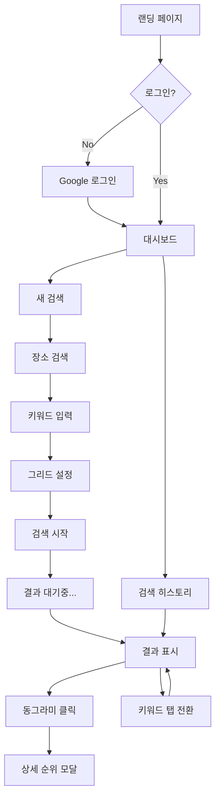

# Local SEO Rank Tracker SaaS 구현 계획

Google Maps 기반 로컬 SEO 순위 추적 SaaS를 개발합니다. 사용자가 비즈니스 위치와 키워드를 입력하면, 지정된 그리드 포인트에서의 검색 순위를 시각화합니다.

## User Review Required

> [!IMPORTANT]
> **결정 필요 사항**
> 1. **프로젝트 이름**: 아직 정해지지 않음 (예: MapRank, LocalGrid, RankRadar 등)
> 2. **캐싱 기간**: 24시간 캐싱 권장 (동의하시나요?)
> 3. **처리 방식**: 백그라운드 처리 권장 (검색 시작 후 폴링으로 결과 확인)

> [!WARNING]
> **외부 계정 필요**
> - Google Cloud Console (Maps API, Places API, OAuth 2.0)
> - DataForSEO 계정
> - Supabase 계정
> - Vercel 계정

---

## 기술 스택

| 영역 | 기술 | 버전 |
|------|------|------|
| Framework | Next.js (App Router) | 14.x |
| Language | TypeScript | 5.x |
| Styling | Tailwind CSS | 3.x |
| Database | Supabase (PostgreSQL) | - |
| Auth | Supabase Auth (Google OAuth) | - |
| Maps | @vis.gl/react-google-maps | 1.x |
| Rank API | DataForSEO | v3 |
| Hosting | Vercel | - |

---

## Proposed Changes

### 프로젝트 구조

```
local-seo-tracker/
├── app/
│   ├── (auth)/
│   │   ├── login/page.tsx
│   │   └── auth/callback/route.ts
│   ├── (dashboard)/
│   │   ├── layout.tsx
│   │   ├── page.tsx                    # Dashboard (검색 히스토리)
│   │   ├── search/
│   │   │   ├── new/page.tsx            # 새 검색 마법사
│   │   │   └── [id]/page.tsx           # 검색 결과 뷰
│   │   └── settings/page.tsx
│   ├── api/
│   │   ├── search/route.ts             # 검색 생성/목록
│   │   ├── search/[id]/route.ts        # 검색 상세
│   │   ├── rank/route.ts               # DataForSEO 호출
│   │   └── usage/route.ts              # 사용량 확인
│   ├── layout.tsx
│   └── page.tsx                        # 랜딩 페이지
├── components/
│   ├── auth/
│   │   └── GoogleLoginButton.tsx
│   ├── search/
│   │   ├── PlaceSearchInput.tsx
│   │   ├── KeywordInput.tsx
│   │   ├── GridConfigurator.tsx        # CSS 그리드 (레거시)
│   │   ├── MapGridConfigurator.tsx     # 지도 기반 그리드 (BrightLocal 스타일)
│   │   ├── DistanceSettings.tsx        # 100m~5km 거리 설정
│   │   └── GridPresets.tsx
│   ├── maps/
│   │   └── GoogleMapsProvider.tsx      # Google Maps API 래퍼
│   ├── results/
│   │   ├── RankHeatmap.tsx
│   │   ├── RankMarker.tsx
│   │   ├── KeywordTabs.tsx
│   │   ├── AverageRankCard.tsx
│   │   └── RankDetailModal.tsx
│   └── ui/
│       └── [...shared components]
├── lib/
│   ├── supabase/
│   │   ├── client.ts
│   │   ├── server.ts
│   │   └── middleware.ts
│   ├── dataforseo/
│   │   └── client.ts
│   ├── utils/
│   │   ├── grid-calculator.ts
│   │   └── rank-colors.ts
│   └── types/
│       └── index.ts
└── supabase/
    └── migrations/
        └── 001_initial_schema.sql
```

---

### Database Schema

#### [NEW] [001_initial_schema.sql](file:///c:/Users/thisi/Documents/Maptamin-local%20seo%20saas/supabase/migrations/001_initial_schema.sql)

```sql
-- Searches 테이블
CREATE TABLE searches (
  id UUID PRIMARY KEY DEFAULT gen_random_uuid(),
  user_id UUID REFERENCES auth.users(id) NOT NULL,
  place_id TEXT NOT NULL,
  place_name TEXT NOT NULL,
  place_address TEXT,
  place_lat DECIMAL(10, 8) NOT NULL,
  place_lng DECIMAL(11, 8) NOT NULL,
  keywords TEXT[] NOT NULL,
  grid_points JSONB NOT NULL,
  grid_distance DECIMAL NOT NULL,
  distance_unit TEXT DEFAULT 'km',
  status TEXT DEFAULT 'pending',
  created_at TIMESTAMPTZ DEFAULT NOW()
);

-- Search Results 테이블
CREATE TABLE search_results (
  id UUID PRIMARY KEY DEFAULT gen_random_uuid(),
  search_id UUID REFERENCES searches(id) ON DELETE CASCADE,
  keyword TEXT NOT NULL,
  grid_index INTEGER NOT NULL,
  grid_lat DECIMAL(10, 8) NOT NULL,
  grid_lng DECIMAL(11, 8) NOT NULL,
  rank INTEGER,
  competitors JSONB,
  created_at TIMESTAMPTZ DEFAULT NOW()
);

-- Daily Usage 테이블
CREATE TABLE daily_usage (
  id UUID PRIMARY KEY DEFAULT gen_random_uuid(),
  user_id UUID REFERENCES auth.users(id) NOT NULL,
  usage_date DATE NOT NULL,
  search_count INTEGER DEFAULT 0,
  UNIQUE(user_id, usage_date)
);

-- Row Level Security
ALTER TABLE searches ENABLE ROW LEVEL SECURITY;
ALTER TABLE search_results ENABLE ROW LEVEL SECURITY;
ALTER TABLE daily_usage ENABLE ROW LEVEL SECURITY;

-- Policies
CREATE POLICY "Users can view own searches"
  ON searches FOR SELECT USING (auth.uid() = user_id);

CREATE POLICY "Users can insert own searches"
  ON searches FOR INSERT WITH CHECK (auth.uid() = user_id);

CREATE POLICY "Users can view own results"
  ON search_results FOR SELECT
  USING (search_id IN (SELECT id FROM searches WHERE user_id = auth.uid()));

CREATE POLICY "Users can view own usage"
  ON daily_usage FOR SELECT USING (auth.uid() = user_id);
```

---

### 핵심 컴포넌트 상세

#### [NEW] GridConfigurator.tsx (레거시)

**CSS 그리드 기반** (지도 없이 작동):
- 15x15 인터랙티브 그리드 캔버스
- 중앙에 비즈니스 마커 표시
- 클릭으로 개별 그리드 포인트 토글
- 드래그로 영역 선택/해제
- 선택된 포인트 수 표시 (n/49)
- 프리셋 버튼 (3x3, 5x5, 7x7)

#### [NEW] MapGridConfigurator.tsx (BrightLocal 스타일)

**지도 기반 그리드** (실제 Google Map 위에 표시):
- `@vis.gl/react-google-maps`의 `AdvancedMarker` 사용
- 실제 Google Map 배경 위에 그리드 포인트를 마커로 표시
- 파란색 마커 = 활성, 회색 마커 = 비활성
- 중앙에 비즈니스 위치 마커 (특별 아이콘)
- 클릭으로 마커 토글 (활성/비활성)
- 자동 Bounds 조정 (모든 마커가 보이도록)
- 거리 변경 시 마커 위치 실시간 업데이트
- 프리셋 버튼 (3x3, 5x5, 7x7, 초기화)

#### [NEW] DistanceSettings.tsx

그리드 포인트 간격 설정:
- 슬라이더: 0.1km ~ 5km (step: 0.1)
- 빠른 프리셋: 100m, 200m, 300m, 400m, 500m, 1km, 2km, 3km, 5km
- km/mile 단위 토글
- 예상 측정 범위(반경) 표시

#### [NEW] RankHeatmap.tsx

결과 시각화 지도:
- Google Maps 배경
- 각 그리드 포인트에 순위 마커
- 색상 코딩:
  - 🟢 1-3위: `#22c55e`
  - 🟡 4-6위: `#84cc16`
  - 🟠 7-10위: `#f97316`
  - 🔴 11-15위: `#ef4444`
  - ⚫ 16+위: `#991b1b`
  - ⬜ 없음: `#888888`

#### [NEW] Grid Coordinate Calculator

```typescript
function calculateGridPoints(
  centerLat: number,
  centerLng: number,
  gridSize: number,  // 3, 5, 7, etc.
  distanceKm: number
): GridPoint[] {
  const points: GridPoint[] = [];
  const halfGrid = Math.floor(gridSize / 2);
  
  const latDegreePerKm = 1 / 111.32;
  const lngDegreePerKm = 1 / (111.32 * Math.cos(centerLat * Math.PI / 180));
  
  for (let row = -halfGrid; row <= halfGrid; row++) {
    for (let col = -halfGrid; col <= halfGrid; col++) {
      points.push({
        row,
        col,
        lat: centerLat + (row * distanceKm * latDegreePerKm),
        lng: centerLng + (col * distanceKm * lngDegreePerKm),
        enabled: true
      });
    }
  }
  
  return points;
}
```

---

### API 엔드포인트

| Method | Endpoint | 설명 |
|--------|----------|------|
| POST | `/api/search` | 새 검색 생성 |
| GET | `/api/search` | 검색 히스토리 조회 |
| GET | `/api/search/[id]` | 검색 결과 조회 |
| POST | `/api/rank` | DataForSEO 순위 조회 (내부용) |
| GET | `/api/usage` | 일일 사용량 확인 |

---

### DataForSEO 통합

**엔드포인트**: `POST https://api.dataforseo.com/v3/serp/google/maps/live/advanced`

**요청 형식**:
```json
{
  "keyword": "cafe",
  "location_coordinate": "49.8880,-119.4960,100",
  "language_code": "en",
  "device": "desktop"
}
```

**비용 추정**:
- 1회 검색 = 49 포인트 × 3 키워드 = 147 API 호출
- 147 × $0.002 = $0.29 (~400원)
- 일 1회 × 30일 = $8.7/월 (~12,000원)

---

### 사용자 플로우



---

### 일일 사용량 제한 로직

```typescript
async function checkDailyUsage(userId: string): Promise<boolean> {
  const today = new Date().toISOString().split('T')[0];
  
  const { data } = await supabase
    .from('daily_usage')
    .select('search_count')
    .eq('user_id', userId)
    .eq('usage_date', today)
    .single();
  
  return !data || data.search_count < 1; // 무료: 일 1회
}

async function incrementUsage(userId: string): Promise<void> {
  const today = new Date().toISOString().split('T')[0];
  
  await supabase.rpc('increment_daily_usage', {
    p_user_id: userId,
    p_date: today
  });
}
```

---

### Change 계산 로직

```typescript
async function calculateChange(
  userId: string,
  placeId: string,
  currentAvgRank: number
): Promise<number> {
  const { data: previousSearch } = await supabase
    .from('searches')
    .select('id')
    .eq('user_id', userId)
    .eq('place_id', placeId)
    .eq('status', 'completed')
    .order('created_at', { ascending: false })
    .limit(1)
    .single();
  
  if (!previousSearch) return 0;
  
  const { data: previousResults } = await supabase
    .from('search_results')
    .select('rank')
    .eq('search_id', previousSearch.id)
    .not('rank', 'is', null);
  
  if (!previousResults?.length) return 0;
  
  const previousAvg = previousResults.reduce((a, b) => a + b.rank!, 0) 
                      / previousResults.length;
  
  return previousAvg - currentAvgRank; // 양수 = 개선됨
}
```

---

## Verification Plan

### 개발 중 테스트

1. **컴포넌트 단위 테스트**
   - 그리드 좌표 계산 함수 테스트
   - 평균 순위 계산 테스트
   - Change 계산 테스트

2. **API 테스트**
   - DataForSEO 연동 테스트 (소량)
   - 사용량 제한 테스트

### 수동 검증

1. **인증 플로우**
   - Google 로그인/로그아웃 정상 동작
   - 비로그인 사용자 접근 차단

2. **검색 플로우**
   - 장소 검색 자동완성 동작
   - 키워드 3개 제한 동작
   - 그리드 49개 제한 동작
   - 결과 시각화 정상 표시

3. **사용량 제한**
   - 일 1회 검색 후 추가 검색 차단
   - 다음 날 검색 가능

4. **브라우저 테스트**
   - Chrome, Safari, Firefox 호환성
   - 모바일 반응형 확인

---

## 예상 비용 (월간)

| 항목 | 무료 티어 | 예상 비용 |
|------|-----------|-----------|
| Vercel | Pro 필요 없음 | $0 |
| Supabase | Free tier | $0 |
| Google Maps | $200 크레딧 | $0 |
| DataForSEO | - | ~$10-15 |
| **Total** | | **~$10-15** |

---

## 타임라인 (10주)

| 주차 | 마일스톤 |
|------|----------|
| 1-2 | 프로젝트 셋업, 인증, DB 스키마 |
| 3-4 | 검색 플로우 UI (장소, 키워드, 그리드) |
| 5-6 | DataForSEO 통합, 백그라운드 처리 |
| 7-8 | 결과 시각화, 키워드 탭, 상세 모달 |
| 9-10 | 히스토리, 폴리싱, 배포 |
