# Maptamin Component Tree & UI Architecture

> **Purpose**: 주요 라우트별 컴포넌트 계층 구조, 각 컴포넌트의 역할, 상태 관리 의존성을 정리한 문서  
> **Last Updated**: 2026-02-25 (코드베이스 검증: OnboardingBanner 추가, History SSR 조회 수정, 컴포넌트 위치/경로 교정, Google Results 상태 분기 보완)  
> **Total Components**: 90개 (15개 디렉토리, 테스트 파일 제외)

---

## Table of Contents

1. [Architecture Overview](#1-architecture-overview)
2. [State Management Strategy](#2-state-management-strategy)
3. [Root & Dashboard Layout](#3-root--dashboard-layout)
4. [Landing Page (/)](#4-landing-page)
5. [Login Page (/login)](#5-login-page)
6. [Dashboard (/dashboard)](#6-dashboard)
7. [Subscription (/dashboard/subscription)](#7-subscription)
8. [Subscription Checkout (/dashboard/subscription/checkout)](#8-subscription-checkout)
9. [Onboarding (/onboarding)](#9-onboarding)
10. [Naver Search — New (/naver-search/new)](#10-naver-search-new)
11. [Naver Search — Results (/naver-search/[id])](#11-naver-search-results)
12. [Google Search — New (/search/new)](#12-google-search-new)
13. [Google Search — Results (/search/[id])](#13-google-search-results)
14. [Settings (/settings)](#14-settings)
15. [History Page (/history)](#15-history-page)
15-1. [Report Settings (/report-settings)](#15-1-report-settings)
16. [Shared UI Primitives](#16-shared-ui-primitives)
17. [Custom Hooks](#17-custom-hooks)
18. [Component Directory Index](#18-component-directory-index)

---

## 1. Architecture Overview

```
Next.js App Router (RSC First)
│
├── Server Components (SSR) — 데이터 fetching, 인증 처리
│   └── Props로 Client Components에 데이터 전달
│
├── Client Components ('use client') — 인터랙션, 상태 관리
│   └── Supabase Client SDK로 클라이언트 사이드 데이터 조회
│
└── State Management:
    ├── ❌ Context API 미사용 (React Context Provider 없음)
    ├── ❌ Redux / Zustand 미사용
    ├── ✅ SSR → Props Drilling (Server → Client)
    ├── ✅ Custom Hook: useSubscription (Supabase 실시간 조회)
    └── ✅ Component-local useState / useEffect
```

---

## 2. State Management Strategy

| 패턴 | 사용처 | 설명 |
|------|--------|------|
| **SSR Props** | Dashboard, Settings, Subscription, Results | Server Component가 Supabase 조회 후 Client Component에 props 전달 |
| **`useSubscription` Hook** | Search New Pages, Client modals | 클라이언트에서 `user_subscriptions` 실시간 조회 (플랜, 티켓, 제한) |
| **Local `useState`** | Onboarding, Search 설정, Modals | 각 컴포넌트 내부 폼 상태, 스텝 상태 관리 |
| **`useRouter` / `useSearchParams`** | Search, Onboarding, Checkout | Next.js 라우팅 + URL 파라미터 기반 상태 |
| **Supabase Client SDK** | Client Components 직접 호출 | 일부 Client Component에서 직접 `createClient()` 호출 (예: 온보딩) |

---

## 3. Root & Dashboard Layout

```
RootLayout (src/app/layout.tsx) [Server]
│   Font: Geist Sans + Geist Mono
│   No providers, no context
│
├─► (auth)/* routes  → 별도 레이아웃 없음
│
├─► (dashboard)/* routes
│   └── DashboardLayout (src/app/(dashboard)/layout.tsx) [Server]
│       │   ★ SSR: auth check → user_subscriptions SELECT
│       │   ★ export const dynamic = 'force-dynamic' (매 요청 DB 조회)
│       │
│       ├── OnboardingGuard [Client]
│       │   └── 유료 플랜 + 온보딩 미완료 → /onboarding 리다이렉트
│       │
│       └── DashboardShell [Client]
│           └── src/components/layout/DashboardShell.tsx
│               │   ★ 사이드바 모드 관리 (pinned/collapsed/hover, localStorage)
│               │   ★ 온보딩 페이지에서는 사이드바 숨김
│               │
│               ├── Desktop (lg 이상): Sidebar [Client]
│               │   └── src/components/layout/Sidebar.tsx
│               │       ├── 3가지 모드: pinned | collapsed | hover
│               │       ├── Navigator 구성:
│               │       │   ├── 대시보드 (Home, /dashboard)
│               │       │   ├── 진단 기록 (History, /history)
│               │       │   ├── 리포트 설정 (CalendarClock, /report-settings, 구독 잠금)
│               │       │   ├── 실시간 순위 진단 (아코디언 그룹)
│               │       │   │   ├── 네이버 (NaverPlatformIcon [N])
│               │       │   │   └── 구글 (GooglePlatformIcon [G], 플랜 잠금)
│               │       │   ├── 설정 (Settings, /settings)
│               │       │   └── 구독 관리 (CreditCard, /dashboard/subscription)
│               │       ├── 티켓/CTA 섹션 (구독 시 WalletLabel, 미구독 시 구독하기 버튼)
│               │       ├── 사용자 프로필 + 로그아웃
│               │       └── 사이드바 접기/펼치기 토글
│               │
│               ├── Mobile (lg 미만): MobileNav [Client]
│               │   └── 햄버거 메뉴 → 슬라이드 오버 네비게이션
│               │
│               └── <main>
│                   └── {children}  ← 각 페이지 라우트
│
└─► Landing page (/) → 별도 레이아웃 없음
```

**의존성**: `createClient` (server), `user_subscriptions` SELECT

---

## 4. Landing Page

```
/ (src/app/page.tsx) [Server]
│
├── Navigation [Client]
│   └── 로고 + CTA 버튼 + 모바일 메뉴
│
├── HeroSection [Client]
│   └── 히어로 타이틀 + 애니메이션 + CTA 버튼
│
├── LogoStripSection [Server]
│   └── 파트너 로고 스트립
│
├── ProblemSection [Server]
│   └── 문제 제기 섹션
│
├── BridgeSection1 [Server]
│   └── 문제 → 솔루션 전환 브릿지 1
│
├── BridgeSection2 [Server]
│   └── 문제 → 솔루션 전환 브릿지 2
│
├── SolutionSection [Server]
│   └── 솔루션 제시 섹션
│
├── FeatureSection [Server]
│   └── 기능 설명 카드 그리드
│
├── SocialProofSection [Server]
│   └── 소셜 프루프 / 후기 섹션
│
├── PricingSection [Client]
│   └── 요금제 비교 카드 (PlanCard × 3)
│       ├── PlanCard [Client] — 월간/연간 토글, CTA 버튼
│       └── FractionOneFifty [Server] — 가격 표시 컴포넌트
│
├── PricingDetailSection [Client] (가격 상세 — /pricing 페이지에서도 사용)
│   └── 플랜별 상세 기능 비교 테이블
│
└── Footer [Server]
    └── 약관/개인정보 링크, 카피라이트
```

**의존성**: 없음 (순수 프레젠테이션, Supabase 미접근)

---

## 5. Login Page

```
/login (src/app/(auth)/login/page.tsx) [Server]
│   ★ searchParams: plan, billing, redirectTo
│
├── KakaoLoginButton [Client]
│   └── supabase.auth.signInWithOAuth({ provider: 'kakao' })
│   └── props: plan, billing, redirectTo
│   └── plan 우선 → checkout, 없으면 redirectTo → next 파라미터
│
└── GoogleLoginButton [Client]
    └── supabase.auth.signInWithOAuth({ provider: 'google' })
    └── props: plan, billing, redirectTo
    └── 동일 로직 (plan 우선, redirectTo 백업)
```

**의존성**: `createClient` (client), Supabase Auth SDK  
**URL Params**: `?plan=`, `?billing=` (결제 플로우), `?redirectTo=` (보호 라우트에서 리다이렉트 시 원래 경로 보존)

---

## 6. Dashboard

```
/dashboard (src/app/(dashboard)/dashboard/page.tsx) [Server]
│   ★ SSR 데이터: user_subscriptions, searches, search_results,
│     managed_places, managed_competitors, managed_keywords, search_schedules
│
├── SubscriptionBanner [Client] (free 플랜일 때만 표시)
│   └── 구독 유도 CTA 배너
│
├── OnboardingBanner [Client] (유료 + 온보딩 미완료일 때만 표시)
│   └── 온보딩 유도 CTA 배너
│
├── DashboardHeader [Client]
│   └── 자동 리포트 상태 표시 (활성/비활성, 다음 리포트 날짜)
│
├── 등록된 내 매장 섹션
│   └── DashboardPlatformCard × 2 [Client]
│       ├── 매장 정보 (이름, 주소, 좌표)
│       ├── 경쟁사 수 / 첫 경쟁사 이름
│       ├── 등록 키워드 목록
│       ├── "실시간 진단" 버튼 → /naver-search/new 또는 /search/new
│       │
│       ├── KeywordManageModal [Client] (모달)
│       │   └── 키워드 추가/삭제 (managed_keywords CRUD)
│       │       └── Supabase Client SDK 직접 호출
│       │
│       └── CompetitorManageModal [Client] (모달)
│           └── 경쟁사 추가/삭제 (API /api/settings/competitors)
│
├── DashboardMetricsToggle [Client]
│   ├── 네이버/구글 토글 스위치
│   └── QuickInsightsRow [Client]
│       └── 주간 인사이트 카드 (평균 순위, 변동 등)
│
└── SearchHistorySection [Client]
    └── SearchHistoryCard × N [Client]
        └── 검색 기록 목록 (날짜, 매장명, 상태, 플랫폼)
        └── → 클릭 시 /naver-search/[id] 또는 /search/[id] 이동
```

**의존성**:
- SSR: 7개 테이블 SELECT (architecture_data_flow.md §10 참조)
- Client: `lib/utils/subscription` 유틸함수, `lib/pricing/config`

---

## 7. Subscription

```
/dashboard/subscription (src/app/(dashboard)/dashboard/subscription/page.tsx) [Server]
│   ★ SSR: user_subscriptions, subscription_billing, subscription_payment_history
│
└── SubscriptionContent [Client]
    ├── actionMessage 상단 알림 배너 (해지 철회/환불 결과)
    │
    ├── 현재 플랜 정보 카드
    │   └── 플랜명, 상태 배지 (이용 중/해지 예약/해지됨)
    │   └── 다음 결제일, 결제 금액, 잔여 티켓 (네이버/구글)
    │   └── 상태: active(자동 결제), cancel_scheduled(종료 예정+해지 철회 버튼), cancelled(만료)
    │
    ├── 결제 수단 정보
    │   └── 카드 끝 4자리, 브랜드, 다음 결제일
    │
    ├── 플랜 업/다운그레이드 버튼
    │   └── PlanCard × N [Client]
    │       └── 월간/연간 토글, 기능 비교, CTA
    │
    ├── 결제 이력 테이블
    │   └── 날짜, 플랜, 금액, 상태, 영수증 (active/cancel_scheduled 둘 다 표시)
    │
    ├── CancelModal [Client] (모달)
    │   └── 해지 확인 → POST /api/payment/subscribe/cancel
    │
    ├── RefundModal [Client] (모달)
    │   └── 환불 확인 (7일 이내 + 미이용) → POST /api/payment/subscribe/refund
    │
    └── Footer (푸터)
        ├── active: "환불 요청" + "구독 해지" 버튼
        ├── cancel_scheduled: "해지 철회" 버튼 → POST /api/payment/subscribe/reactivate
        └── cancelled: footer 숨김
```

**의존성**:
- SSR: `user_subscriptions`, `subscription_billing`, `subscription_payment_history` SELECT
- Client: `lib/portone/client.ts`, `lib/pricing/config`

---

## 8. Subscription Checkout

```
/dashboard/subscription/checkout (src/app/(dashboard)/dashboard/subscription/checkout/page.tsx)
│
└── CheckoutContent [Client]
    ├── 선택된 플랜 요약 카드
    ├── 월간/연간 결제 선택
    ├── PortOne 빌링키 발급 버튼
    │   └── PortOne.requestIssueBillingKey() → billingKey 획득
    │
    └── 구독 시작 버튼
        └── POST /api/payment/subscribe (billingKey + planId + billingCycle)
```

**의존성**:
- Client: `@portone/browser-sdk/v2`, `lib/portone/subscription-client.ts`
- URL Params: `?plan=`, `?cycle=`

---

## 9. Onboarding

```
/onboarding (src/app/(dashboard)/onboarding/page.tsx) [Client]
│   ★ 'use client' — 전체 페이지가 Client Component
│   ★ 내부 스텝 상태: useState(currentStep), useState<OnboardingData>
│   ★ 접근 제어: Server(OnboardingGuard) + Client(plan_id/onboarding_completed 체크)
│   ★ 이탈 복구: computeStartStep()으로 마지막 미완료 Step부터 재진입
│   ★ 유틸 함수: onboarding-utils.ts (getOnboardingSteps, computeStartStep)
│
├── 스텝 프로그레스 바 (플랜에 따라 4~5 Step)
│   └── Starter: store → keyword → grid → schedule
│   └── Pro/Premium: store → keyword → competitor → grid → schedule
│
├── Step 1: StepStoreRegister [Client]
│   ├── NaverPlaceSearchInput → 네이버 장소 검색
│   └── PlaceSearchInput → 구글 장소 검색 (Premium)
│   └── POST /api/settings/my-shop (등록 + 30일 락 AlertDialog)
│
├── Step 2: StepKeywordRegister [Client]
│   └── KeywordInput [Client] (platform prop으로 네이버/구글 분기)
│       ├── 네이버: 지역명 제외 안내 + 예시
│       └── 구글: 지역명 포함 가능 안내 + 예시
│   └── managed_keywords INSERT (Supabase Client 직접)
│
├── Step 3: StepCompetitorRegister [Client] (Pro/Premium만)
│   └── CompetitorSlotCard × N → 경쟁사 슬롯
│   └── POST /api/settings/competitors (등록)
│
├── Step 4: StepGridSetting [Client]
│   ├── 네이버/구글 탭 (Premium만 구글 탭 노출)
│   ├── NaverMapGridConfigurator [Client] → 네이버 지도 좌표 설정
│   ├── MapGridConfigurator [Client] → 구글 지도 좌표 설정 (Premium)
│   ├── DistanceSettings [Client] → 분석 좌표 간격 슬라이더
│   └── 플랜별 그리드 제한: starter=3×3, pro=5×5, premium=7×7
│   └── 로컬 state만, DB 저장 안함
│
├── Step 5: StepScheduleSetting [Client]
│   └── DaySelector / TimeSelector → 요일/시간 선택
│   └── 전화번호 입력 (알림톡 수신용)
│   └── search_schedules + notification_schedules INSERT (플랫폼별)
│   └── user_subscriptions.phone UPDATE
│
└── OnboardingComplete [Client] (모든 Step 완료 후)
    └── 웰컴 리포트 실행: POST /api/naver/search (+ /api/search for Premium)
    └── 폴링 (네이버/구글 독립, 3초 간격 × 최대 3분)
    └── 완료 시: "결과 보러가기" 버튼
    └── 실패 시: "대시보드로 이동" 버튼
```

**의존성**:
- Supabase Client SDK (직접 호출)
- API Routes: `/api/settings/my-shop`, `/api/settings/competitors`, `/api/naver/search`, `/api/search`
- `onboarding-utils.ts`: `getOnboardingSteps()`, `computeStartStep()`
- `NaverMapGridConfigurator`, `MapGridConfigurator`, `DistanceSettings` (기존 컴포넌트 재사용)
- `CompetitorSlotCard` (competitor/ 디렉토리)
- `DaySelector`, `TimeSelector` (schedule/ 디렉토리)
- `PLAN_CONFIG` (플랜별 그리드 크기 조회)

---

## 10. Naver Search — New

```
/naver-search/new (src/app/(dashboard)/naver-search/new/page.tsx) [Client]
│   ★ 'use client' — 전체 Client Component
│   ★ useSubscription() Hook — 플랜, 티켓, 그리드 제한 정보
│   ★ Multi-step wizard: [키워드 선택 → 그리드 설정 → 결제 및 확인]
│
├── PlaceSelectionModal [Client] (조건부: 매장 미등록 시 자동 표시)
│   ├── NaverPlaceSearchInput [Client]
│   │   └── 네이버 places API 호출
│   └── POST /api/settings/my-shop (modal 내 등록)
│
├── Step 1: 키워드 선택
│   └── 등록된 managed_keywords 목록에서 토글 선택
│
├── Step 2: 그리드 설정
│   └── NaverMapGridConfigurator [Client]
│       ├── NaverMap [Client]
│       │   └── react-naver-maps (Naver Maps SDK)
│       │   └── 지도 위 그리드 포인트 시각화 + 클릭 토글
│       └── DistanceSettings [Client]
│           └── 간격(km) 조절 슬라이더
│
└── Step 3: 확인
    └── 요약 카드 → "진단 시작" 버튼
    └── POST /api/naver/search → 검색 생성 → /naver-search/[id] 리다이렉트
```

**의존성**:
- `useSubscription` Hook
- `react-naver-maps` (Naver Maps JavaScript SDK)
- API: `/api/naver/search`, `/api/settings/my-shop`
- Supabase Client: `managed_keywords`, `managed_places`, `managed_competitors` SELECT

---

## 11. Naver Search — Results

```
/naver-search/[id] (src/app/(dashboard)/naver-search/[id]/page.tsx) [Server]
│   ★ SSR (Promise.all): searches, search_results, managed_competitors, user_subscriptions
│
├── NaverResultsHeader [Client]
│   └── 네이버 브랜딩 결과 헤더 (매장명, 날짜, 키워드)
│
├── (status === 'processing')
│   └── SearchStatusPoller [Client]
│       └── setInterval로 /api/naver/search/[id] 폴링 → status 변경 시 새로고침
│
└── (status === 'completed')
    └── NaverResultsContent [Client]
        │   ★ co-located: src/app/(dashboard)/naver-search/[id]/NaverResultsContent.tsx
        ├── SearchResultsOverview [Client]
        │   └── 전체 키워드별 평균 순위 요약
        │
        ├── KeywordTabs [Client]
        │   └── 키워드 탭 전환
        │
        ├── NaverRankHeatmap [Client]
        │   └── 네이버 지도 위 히트맵 시각화 (순위 컬러 마커)
        │
        ├── AverageRankCard [Client]
        │   └── 선택 키워드 평균 순위 카드
        │
        ├── RankDetailModal [Client] (모달)
        │   └── 그리드 포인트 클릭 시 상세 순위 정보
        │
        ├── NaverCompetitorComparisonMap [Client]
        │   └── 경쟁사 vs 내 매장 지도 비교
        │
        └── CompetitorComparisonPanel [Client]
            ├── CompetitorSelector [Client]
            │   └── 비교할 경쟁사 선택 드롭다운
            └── CompetitorDetailModal [Client]
                └── 경쟁사 상세 순위 모달
```

**의존성**:
- SSR: `searches`, `search_results`, `managed_competitors`, `user_subscriptions` SELECT
- Client: `react-naver-maps`, `lucide-react`

---

## 12. Google Search — New

```
/search/new (src/app/(dashboard)/search/new/page.tsx) [Client]
│   ★ 'use client' — 전체 Client Component
│   ★ useSubscription() Hook
│   ★ Multi-step wizard: [키워드 선택 → 그리드 설정 → 확인]
│
├── PlaceSelectionModal [Client] (조건부)
│   ├── PlaceSearchInput [Client]
│   │   └── Google Places Autocomplete API
│   └── POST /api/settings/my-shop
│
├── GoogleMapsProvider [Client] (dynamic import, ssr: false)
│   └── @vis.gl/react-google-maps Provider
│
├── Step 1: 키워드 선택
│   └── managed_keywords 목록에서 토글 선택
│
├── Step 2: 그리드 설정
│   └── MapGridConfigurator [Client]
│       └── Google Maps 위 그리드 포인트 시각화
│
└── Step 3: 확인
    └── POST /api/search → /search/[id] 리다이렉트
```

**의존성**:
- `useSubscription` Hook
- `@vis.gl/react-google-maps` (dynamic import)
- API: `/api/search`, `/api/settings/my-shop`
- Supabase Client: `managed_keywords`, `managed_places`, `managed_competitors` SELECT

---

## 13. Google Search — Results

```
/search/[id] (src/app/(dashboard)/search/[id]/page.tsx) [Server]
│   ★ SSR (Promise.all): searches, search_results, managed_competitors, user_subscriptions
│
├── (status === 'pending')
│   └── 대기 중 UI (아이콘 + 안내 메시지)
│
├── (status === 'processing')
│   └── 처리 중 스피너 UI
│
├── (status === 'failed')
│   └── 실패 UI (에러 안내)
│
└── (status === 'completed')
    └── ResultsContent [Client]
        │   ★ co-located: src/app/(dashboard)/search/[id]/ResultsContent.tsx
        ├── SearchResultsOverview [Client]
        ├── KeywordTabs [Client]
        ├── RankHeatmap [Client]
        │   └── Google Maps 위 히트맵 시각화
        ├── AverageRankCard [Client]
        ├── RankDetailModal [Client]
        ├── CompetitorComparisonMap [Client]
        │   └── Google Maps 위 경쟁사 비교
        └── CompetitorComparisonPanel [Client]
            ├── CompetitorSelector [Client]
            └── CompetitorDetailModal [Client]
```

**의존성**: Naver Results와 동일 구조, Google Maps SDK 사용

---

## 14. Settings

```
/settings (src/app/(dashboard)/settings/page.tsx) [Server]
│   ★ SSR: user info, user_subscriptions SELECT
│
└── SettingsContent [Client]
    │   ★ 'use client' — 탭 전환, 로그아웃 등 인터랙션
    │
    ├── 프로필 섹션
    │   └── 이메일, 이름, 아바타, 가입일 표시
    │
    ├── 플랜 정보 섹션
    │   └── 현재 플랜명, 제한 정보 표시
    │   └── "플랜 변경" → /dashboard/subscription 이동
    │
    ├── MyShopManager [Client]
    │   └── 네이버/구글 매장 관리 (편집/삭제)
    │   └── API: /api/settings/my-shop (GET, POST, DELETE)
    │
    ├── KeywordManager [Client]
    │   └── 키워드 관리 (추가/삭제)
    │   └── Supabase Client 직접 호출
    │
    ├── CompetitorManager [Client]
    │   └── 경쟁사 관리 (타입 재사용: CompetitorManagementView)
    │   └── API: /api/settings/competitors
    │
    ├── CancelSubscriptionSection [Client]
    │   └── 구독 해지 확인 다이얼로그
    │   └── POST /api/payment/subscribe/cancel
    │
    ├── DeleteAccountSection [Client]
    │   └── 계정 삭제 확인 다이얼로그
    │   └── POST /api/auth/delete-account
    │
    └── 로그아웃 버튼
        └── POST /auth/signout
```

**의존성**:
- SSR: `user_subscriptions` SELECT
- Client: `createClient` (client), `lib/utils/subscription`, `lib/pricing/config`
- API: `/api/settings/my-shop`, `/api/settings/competitors`, `/api/payment/subscribe/cancel`, `/api/auth/delete-account`

---

## 15. History Page (/history)

```
/history (src/app/(dashboard)/history/page.tsx) [Server]
│   ★ SSR (Promise.all): user_subscriptions, searches, managed_places
│   ★ 추가 SELECT: search_results (weekly search IDs만)
│   ★ export const dynamic = 'force-dynamic'
│   ★ 플랫폼별 현재 매장 place_id로 검색 필터링
│   ★ extractKeywordsFromTrend()로 trend 데이터에서 키워드 목록 추출
│
└── HistoryPageContent [Client]
    │   ★ 'use client' — 플랫폼 토글 + 필터 상태 관리
    │
    ├── 플랫폼 토글 (네이버/구글)
    │   └── 그래프 데이터 전환 (naverTrend / googleTrend)
    │
    ├── RankTrendChart [Client]
    │   ├── 키워드 토글 버튼 (활성/비활성, 최소 1개 유지)
    │   ├── recharts LineChart (dynamic import, ssr: false)
    │   │   ├── ResponsiveContainer
    │   │   ├── Y축 reversed (1위=위)
    │   │   └── Custom Tooltip (날짜 + 키워드별 순위)
    │   └── 데이터 부족 시 안내 메시지 ("주간 리포트 2회 이상 누적 필요")
    │
    ├── 필터 바
    │   ├── 플랫폼 필터 (전체/네이버/구글)
    │   └── 리포트 유형 필터 (전체/주간/실시간/웰컴)
    │
    └── HistoryTable [Client]
        ├── 상태 배지 (완료/분석 중/대기/실패)
        ├── 리포트 유형 배지 (주간/실시간/웰컴)
        ├── 페이지네이션 (10건/페이지)
        └── 결과 상세 링크 → /naver-search/[id] 또는 /search/[id]
```

**의존성**:
- SSR: `user_subscriptions`, `searches`, `managed_places`, `search_results` SELECT
- Client: `recharts` (dynamic import), `lucide-react`
- Util: `src/lib/utils/rank-trend.ts` (`calculateRankTrend`, `extractKeywordsFromTrend`)

---

## 15-1. Report Settings (/report-settings)

```
/report-settings (src/app/(dashboard)/report-settings/page.tsx) [Server]
│   ★ SSR: user_subscriptions, search_schedules, managed_places, managed_keywords
│   ★ export const dynamic = 'force-dynamic'
│   ★ 구독 사용자만 접근 가능 (사이드바에서 잠금 표시)
│
└── ReportSettingsContent [Client]
    │   ★ 'use client' — 스케줄 편집, 키워드 선택, 그리드 설정, 알림 설정
    │
    ├── 네이버/구글 플랫폼 탭
    │
    ├── 스케줄 설정 섹션
    │   ├── DaySelector [Client] → 요일 선택
    │   ├── TimeSelector [Client] → 시간 선택
    │   └── MyShopSelector [Client] → 매장 선택
    │
    ├── 키워드 선택 (등록된 managed_keywords 에서 토글)
    │
    ├── 그리드 설정
    │   ├── NaverMapGridConfigurator [Client] → 네이버 지도 좌표 설정
    │   ├── MapGridConfigurator [Client] → 구글 지도 좌표 설정 (Premium)
    │   └── DistanceSettings [Client] → 좌표 간격 조절
    │
    ├── 알림 설정 (전화번호 입력)
    │
    └── 저장 버튼 → POST /api/settings/schedule
```

**의존성**:
- SSR: `user_subscriptions`, `search_schedules`, `managed_places`, `managed_keywords` SELECT
- Client: `NaverMapGridConfigurator`, `MapGridConfigurator`, `DistanceSettings` (기존 컴포넌트 재사용)
- API: `/api/settings/schedule`

---

## 16-A. Shared UI Primitives

`src/components/ui/` — Radix UI / Shadcn 기반 공통 컴포넌트

| Component | File | Description |
|-----------|------|-------------|
| `Button` | `button.tsx` | 범용 버튼 (variant, size) |
| `Badge` | `badge.tsx` | 상태/태그 뱃지 |
| `Card` | `card.tsx` | 카드 컨테이너 (Header, Content, Footer) |
| `Dialog` | `dialog.tsx` | 모달 다이얼로그 (Radix Dialog) |

---

## 17. Custom Hooks

### `useSubscription` — 구독 상태 조회 Hook

| File | `src/lib/hooks/useSubscription.ts` |
|------|------|
| **Type** | Client-side Hook (`'use client'`) |
| **Data Source** | `user_subscriptions` (Supabase Client SDK) |
| **Returns** | `planId`, `isSubscribed`, `remainingTicketsNaver/Google`, `onboardingCompleted`, `loading` |
| **Derived** | `canAccessPlatform()`, `getAllowedGridSizes()`, `canManageCompetitors()`, `getMaxKeywords()`, `getMaxCompetitors()`, `getPlanDisplayName()` |
| **Used In** | `NewNaverSearchPage`, `NewSearchPage`, Client-side modals |

**내부 동작**:
1. `useEffect` → `createClient()` → `supabase.auth.getUser()`
2. `supabase.from('user_subscriptions').select(...)` → `useState` 업데이트
3. `lib/utils/subscription` 유틸함수 호출로 파생 값 계산

---

## 18. Component Directory Index

| Directory | Count | Description | Key Components |
|-----------|-------|-------------|----------------|
| `auth/` | 2 | 로그인 버튼 | `KakaoLoginButton`, `GoogleLoginButton` |
| `competitor/` | 2 | 경쟁사 관리 | `CompetitorManagementView`, `CompetitorSlotCard` |
| `dashboard/` | 21 | 대시보드 핵심 | `DashboardPlatformCard`, `SubscriptionContent`, `SearchHistorySection`, `PlanCard`, `CheckoutContent`, `TicketShopContent`, `OnboardingBanner`, `CompetitorManageModal`, `KeywordManageModal` |
| `history/` | 3 | 진단 기록 | `HistoryPageContent`, `RankTrendChart`, `HistoryTable` |
| `landing/` | 14 | 랜딩 페이지 | `Navigation`, `HeroSection`, `PricingSection`, `PricingDetailSection`, `Footer`, `MaptaminLogo`, `FractionOneFifty` |
| `layout/` | 7 | 레이아웃 공통 | `DashboardShell`, `Sidebar` (3모드, 커스텀 플랫폼 아이콘), `MobileNav`, `DesktopNav` (레거시), `OnboardingGuard`, `WalletLabel`, `NavDropdown` |
| `maps/` | 1 | Google Maps | `GoogleMapsProvider` |
| `naver/` | 4 | 네이버 지도 | `NaverMap`, `NaverMapGridConfigurator`, `NaverRankHeatmap`, `NaverCompetitorComparisonMap` |
| `onboarding/` | 6 | 온보딩 스텝 | `StepStoreRegister`, `StepKeywordRegister`, `StepCompetitorRegister`, `StepGridSetting`, `StepScheduleSetting`, `OnboardingComplete` |
| `results/` | 10 | 검색 결과 | `RankHeatmap`, `KeywordTabs`, `CompetitorComparisonPanel`, `AverageRankCard`, `NaverResultsHeader`, `CompetitorComparisonMap` |
| `schedule/` | 3 | 스케줄 선택 | `DaySelector`, `TimeSelector`, `MyShopSelector` |
| `search/` | 8 | 검색 설정 | `MapGridConfigurator`, `PlaceSearchInput`, `NaverPlaceSearchInput`, `SearchStatusPoller`, `KeywordInput`, `DistanceSettings`, `GridConfigurator`, `PlaceSelector` |
| `settings/` | 5 | 설정 관리 | `MyShopManager`, `KeywordManager`, `CompetitorManager`, `CancelSubscriptionSection`, `DeleteAccountSection` |
| `ui/` | 4 | UI 프리미티브 | `Button`, `Badge`, `Card`, `Dialog` |
| **Total** | **90** | | |

> **Note**: `NaverResultsContent`(→ naver-search/[id]/), `ResultsContent`(→ search/[id]/), `SettingsContent`(→ settings/) 등은 페이지와 **co-located** 파일이며, `src/components/`가 아닌 `src/app/(dashboard)/`에 위치합니다.
> **테스트 파일** (4건): `DashboardPlatformCard.test.tsx`, `InlineRankGraph.test.tsx`, `PlanCard.test.tsx`, `SubscriptionContent.test.tsx` — 위 카운트에서 제외

---

## Architecture Diagram (Mermaid)

```mermaid
graph TD
    subgraph "Root Layout"
        RL["RootLayout (Server)"]
    end

    subgraph "Dashboard Layout"
        DL["DashboardLayout (Server)"]
        OG["OnboardingGuard"]
        DS["DashboardShell"]
        SB_NAV["Sidebar (3모드)"]
        MN["MobileNav"]
        WL["WalletLabel"]
    end

    subgraph "Pages"
        LP["Landing /"]
        LG["Login /login"]
        DP["Dashboard /dashboard"]
        SS["Subscription /dashboard/subscription"]
        CO["Checkout /dashboard/subscription/checkout"]
        OB["Onboarding /onboarding"]
        NS["Naver Search /naver-search/new"]
        NR["Naver Results /naver-search/id"]
        GS["Google Search /search/new"]
        GR["Google Results /search/id"]
        ST["Settings /settings"]
        HI["History /history"]
        RS["Report Settings /report-settings"]
    end

    subgraph "Key Components"
        DPC["DashboardPlatformCard"]
        SC["SubscriptionContent"]
        CC["CheckoutContent"]
        NRC["NaverResultsContent"]
        RC["ResultsContent"]
        SEC["SettingsContent"]
        HPC["HistoryPageContent"]
        RTC["RankTrendChart"]
        RSC["ReportSettingsContent"]
        NMGC["NaverMapGridConfigurator"]
        MGC["MapGridConfigurator"]
        PSM["PlaceSelectionModal"]
    end

    subgraph "Data Sources"
        SB["Supabase (Server)"]
        SBC["Supabase (Client)"]
        USH["useSubscription Hook"]
        PO["PortOne SDK"]
    end

    RL --> DL
    RL --> LP
    RL --> LG

    DL --> OG --> DS
    DS --> SB_NAV & MN
    SB_NAV --> WL
    DS --> DP & SS & CO & OB & NS & NR & GS & GR & ST & HI & RS

    DP --> DPC
    SS --> SC
    CO --> CC
    NR --> NRC
    GR --> RC
    ST --> SEC
    HI --> HPC
    HPC --> RTC
    RS --> RSC
    RSC --> NMGC & MGC
    NS --> NMGC & PSM
    GS --> MGC & PSM

    DP -.->|SSR Props| SB
    SS -.->|SSR Props| SB
    NR -.->|SSR Props| SB
    GR -.->|SSR Props| SB
    ST -.->|SSR Props| SB
    HI -.->|SSR Props| SB
    RS -.->|SSR Props| SB

    NS -.->|Hook| USH
    GS -.->|Hook| USH
    CO -.->|SDK| PO
    OB -.->|Direct| SBC

    USH -.->|Query| SBC
```



---

> **Note**: 이 프로젝트는 Context API를 사용하지 않으며, 서버 컴포넌트에서 Supabase 데이터를 조회한 후 Props로 클라이언트 컴포넌트에 전달하는 **SSR-first** 패턴을 채택하고 있습니다. 클라이언트 사이드에서 데이터가 필요한 경우 `useSubscription` Hook 또는 Supabase Client SDK 직접 호출을 사용합니다.
