# Maptamin ERD (Entity Relationship Diagram)

> **Version**: 2.5 (일간 트래킹 + 플랜 확정값 반영)
> **Last Updated**: 2026-03-15
> **Source**: `supabase/migrations/001 ~ 027` + `src/lib/types/index.ts`

---

## 1. ERD 다이어그램

```mermaid
erDiagram
    %% ══════════════════════════════════════
    %% AUTH & SUBSCRIPTION
    %% ══════════════════════════════════════

    AUTH_USERS {
        uuid id PK
        text email
        jsonb raw_user_meta_data
        timestamptz created_at
    }

    PLANS {
        text id PK "free | starter | pro | premium"
        text name
        int price
        int max_grid_size "3 | 5 | 7"
        int max_keywords_naver
        int max_keywords_google
        int monthly_tickets_naver
        int monthly_tickets_google
        int max_competitors
        text channels "naver | naver+google"
        boolean place_lock
    }

    USER_SUBSCRIPTIONS {
        uuid user_id PK,FK "→ auth.users"
        text plan_id FK "→ plans"
        text phone "알림톡 수신번호"
        int remaining_tickets_naver
        int remaining_tickets_google
        boolean onboarding_completed
        boolean welcome_report_sent
        timestamptz current_period_start
        timestamptz current_period_end
        timestamptz updated_at
    }

    SUBSCRIPTION_BILLING {
        uuid id PK
        uuid user_id FK,UK "→ auth.users (UNIQUE)"
        text billing_key "PortOne 빌링키"
        text card_last4
        text card_brand
        text plan_id FK "→ plans"
        text pending_plan_id FK "→ plans (다음 결제 시 적용)"
        text status "active | cancel_scheduled | cancelled | past_due | expired"
        text billing_cycle "monthly | yearly"
        text next_payment_id
        timestamptz next_billing_date
        int retry_count
        timestamptz cancelled_at
    }

    SUBSCRIPTION_PAYMENT_HISTORY {
        uuid id PK
        uuid user_id FK "→ auth.users"
        uuid billing_id FK "→ subscription_billing"
        text payment_id UK "PortOne paymentId (UNIQUE)"
        text plan_id FK "→ plans"
        int amount
        text status "paid | failed | refunded"
        timestamptz period_start
        timestamptz period_end
        text failure_reason
        text receipt_url
    }

    %% ══════════════════════════════════════
    %% MANAGED ASSETS (자산 관리)
    %% ══════════════════════════════════════

    MANAGED_PLACES {
        uuid id PK
        uuid user_id FK "→ auth.users"
        text platform "naver | google"
        text place_id
        text place_name
        text address
        float lat
        float lng
        timestamptz locked_until "30일 락"
        timestamptz created_at
    }

    MANAGED_KEYWORDS {
        uuid id PK
        uuid user_id FK "→ auth.users"
        text platform "naver | google"
        text keyword
        timestamptz locked_until "30일 락"
        timestamptz created_at
    }

    MANAGED_COMPETITORS {
        uuid id PK
        uuid user_id FK "→ auth.users"
        text platform "naver | google"
        text place_id
        text place_name
        text address
        float lat
        float lng
        timestamptz locked_until
        timestamptz created_at
    }

    %% ══════════════════════════════════════
    %% SEARCH & RESULTS
    %% ══════════════════════════════════════

    SEARCHES {
        uuid id PK
        uuid user_id FK "→ auth.users"
        text place_id
        text place_name
        text place_address
        decimal place_lat
        decimal place_lng
        text_array keywords "TEXT[]"
        jsonb grid_points
        decimal grid_distance
        text distance_unit "km | mile"
        text status "pending | processing | completed | failed"
        text platform "naver | google"
        text report_type "realtime | daily | weekly | welcome"
        timestamptz deleted_at
        timestamptz created_at
    }

    SEARCH_RESULTS {
        uuid id PK
        uuid search_id FK "→ searches"
        text keyword
        int grid_index
        decimal grid_lat
        decimal grid_lng
        int rank
        jsonb competitors
        jsonb competitor_ranks
        timestamptz created_at
    }

    %% ══════════════════════════════════════
    %% SCHEDULING & NOTIFICATIONS
    %% ══════════════════════════════════════

    SEARCH_SCHEDULES {
        uuid id PK
        uuid user_id FK "→ auth.users"
        text platform "naver | google"
        text place_id
        text place_name
        text_array keywords "TEXT[]"
        jsonb grid_config
        decimal grid_distance
        text distance_unit
        int crawling_day "구글 단일 요일 0-6 (주 1회)"
        int_array crawling_days "네이버 복수 요일 INT[] (선택 요일마다)"
        time crawling_time
        boolean is_active
        timestamptz last_run_at
    }

    NOTIFICATION_SCHEDULES {
        uuid id PK
        uuid user_id FK "→ auth.users"
        uuid search_schedule_id FK "→ search_schedules"
        boolean is_immediate
        int notify_day "0-6"
        time notify_time
    }

    NOTIFICATION_LOGS {
        uuid id PK
        uuid user_id FK "→ auth.users"
        uuid search_id FK "→ searches"
        text type "welcome | daily | weekly | realtime"
        text status "pending | sent | failed"
        text sent_via "solapi"
        text error_message
        timestamptz sent_at
        timestamptz created_at
    }

    %% ══════════════════════════════════════
    %% TICKET & PAYMENT LEDGER
    %% ══════════════════════════════════════

    TICKET_LEDGER {
        uuid id PK
        uuid user_id FK "→ auth.users"
        text platform "naver | google"
        int amount "-1 사용 | +1 환불 | +N 충전"
        text type "usage | refund | monthly_reset | welcome_bonus"
        text description
        uuid search_id FK "→ searches (optional)"
        timestamptz created_at
    }

    PAYMENT_HISTORY {
        uuid id PK
        uuid user_id FK "→ auth.users"
        text payment_id "PortOne paymentId"
        text platform "naver | google"
        int quantity
        int amount
        text status "paid"
        text order_name
        timestamptz created_at
    }

    %% ══════════════════════════════════════
    %% RELATIONSHIPS
    %% ══════════════════════════════════════

    AUTH_USERS ||--|| USER_SUBSCRIPTIONS : "1:1 가입 시 트리거 생성"
    AUTH_USERS ||--o| SUBSCRIPTION_BILLING : "1:0..1 구독 시 생성"
    AUTH_USERS ||--o{ SUBSCRIPTION_PAYMENT_HISTORY : "1:N 결제 이력"
    AUTH_USERS ||--o{ MANAGED_PLACES : "1:N 매장 등록"
    AUTH_USERS ||--o{ MANAGED_KEYWORDS : "1:N 키워드 등록"
    AUTH_USERS ||--o{ MANAGED_COMPETITORS : "1:N 경쟁사 등록"
    AUTH_USERS ||--o{ SEARCHES : "1:N 검색 요청"
    AUTH_USERS ||--o{ SEARCH_SCHEDULES : "1:N 자동 스케줄"
    AUTH_USERS ||--o{ NOTIFICATION_SCHEDULES : "1:N 알림 스케줄"
    AUTH_USERS ||--o{ NOTIFICATION_LOGS : "1:N 알림 이력"
    AUTH_USERS ||--o{ TICKET_LEDGER : "1:N 티켓 원장"
    AUTH_USERS ||--o{ PAYMENT_HISTORY : "1:N 결제 이력"

    PLANS ||--o{ USER_SUBSCRIPTIONS : "1:N 플랜 적용"
    PLANS ||--o{ SUBSCRIPTION_BILLING : "1:N 구독 플랜"
    PLANS ||--o{ SUBSCRIPTION_PAYMENT_HISTORY : "1:N 결제 플랜"

    SUBSCRIPTION_BILLING ||--o{ SUBSCRIPTION_PAYMENT_HISTORY : "1:N 결제 이력"

    SEARCHES ||--o{ SEARCH_RESULTS : "1:N 그리드별 결과"
    SEARCHES ||--o{ NOTIFICATION_LOGS : "1:N 알림 연결"
    SEARCHES ||--o{ TICKET_LEDGER : "1:N 티켓 사용/환불"

    SEARCH_SCHEDULES ||--o| NOTIFICATION_SCHEDULES : "1:0..1 알림 설정"
```

---

## 2. 테이블 상세 정의

### 2-A. Auth & Subscription 그룹

#### `auth.users` (Supabase Auth 관리)

> Supabase가 자동 관리하는 테이블. 직접 생성하지 않음.

| Column | Type | Constraint | Description |
|--------|------|-----------|-------------|
| `id` | UUID | **PK** | 사용자 고유 ID |
| `email` | TEXT | | 이메일 (OAuth Provider에서 전달) |
| `raw_user_meta_data` | JSONB | | 카카오/구글 프로필 정보 |
| `created_at` | TIMESTAMPTZ | | 가입일 |

**트리거**: `on_auth_user_created` → `handle_new_user()` → `user_subscriptions` INSERT (plan='free')

---

#### `plans`

| Column | Type | Constraint | Description |
|--------|------|-----------|-------------|
| `id` | TEXT | **PK** | `free`, `starter`, `pro`, `premium` |
| `name` | TEXT | NOT NULL | 표시명 ("`무료 (Free)`", "`스타터 (Starter)`", ...) |
| `price` | INT | NOT NULL, DEFAULT 0 | 월간 가격 (원) |
| `max_grid_size` | INT | NOT NULL | 그리드 크기 (0, 3, 5, 7) |
| `max_keywords_naver` | INT | NOT NULL | 네이버 최대 키워드 수 |
| `max_keywords_google` | INT | NOT NULL | 구글 최대 키워드 수 |
| `monthly_tickets_naver` | INT | NOT NULL | 월간 네이버 티켓 |
| `monthly_tickets_google` | INT | NOT NULL | 월간 구글 티켓 |
| `max_competitors` | INT | NOT NULL | 최대 경쟁사 수 |
| `channels` | TEXT | NOT NULL | `'none'`, `'naver'`, `'naver+google'` |
| `place_lock` | BOOLEAN | NOT NULL | 30일 락 적용 여부 |
| `monthly_points` | BIGINT | NOT NULL | (레거시, 0으로 유지) |
| `limits` | JSONB | NOT NULL | (레거시) |

**Seed Data:**

| id | name | price | grid | naver tickets | google tickets | naver keywords | google keywords | max_competitors |
|----|------|-------|------|--------------|----------------|----------------|-----------------|------------------|
| `free` | 무료 | 0 | 0 | 0 | 0 | 0 | 0 | 0 |
| `starter` | 스타터 | 9,900 | 3×3 | **2** | 0 | **2** | 0 | **0** |
| `pro` | 프로 | 29,000 | 5×5 | **5** | 0 | **5** | 0 | **5** |
| `premium` | 프리미엄 | **79,000** | 7×7 | **10** | **10** | **5** | **5** | **-1 (무제한)** |

---

#### `user_subscriptions`

| Column | Type | Constraint | Description |
|--------|------|-----------|-------------|
| `user_id` | UUID | **PK**, FK → `auth.users` | 사용자 ID (1:1) |
| `plan_id` | TEXT | FK → `plans`, DEFAULT `'free'` | 현재 플랜 |
| `phone` | TEXT | NULLABLE | 알림톡 수신 전화번호 |
| `remaining_tickets_naver` | INT | NOT NULL, DEFAULT 0 | 잔여 네이버 티켓 |
| `remaining_tickets_google` | INT | NOT NULL, DEFAULT 0 | 잔여 구글 티켓 |
| `onboarding_completed` | BOOLEAN | NOT NULL, DEFAULT false | 온보딩 완료 여부 |
| `welcome_report_sent` | BOOLEAN | NOT NULL, DEFAULT false | 웰컴 리포트 발송 여부 |
| `current_period_start` | TIMESTAMPTZ | DEFAULT NOW() | 현재 구독 기간 시작 |
| `current_period_end` | TIMESTAMPTZ | DEFAULT NOW()+30d | 현재 구독 기간 끝 |
| `updated_at` | TIMESTAMPTZ | | 마지막 수정일 |

**RLS**: 본인 SELECT/UPDATE만 허용

---

#### `subscription_billing`

| Column | Type | Constraint | Description |
|--------|------|-----------|-------------|
| `id` | UUID | **PK** | |
| `user_id` | UUID | FK → `auth.users`, **UNIQUE** | 사용자당 1개 |
| `billing_key` | TEXT | NOT NULL | PortOne 빌링키 |
| `card_last4` | TEXT | | 카드 끝 4자리 |
| `card_brand` | TEXT | | 카드 브랜드 (신한, 국민 등) |
| `plan_id` | TEXT | FK → `plans` | 구독 중 플랜 |
| `pending_plan_id` | TEXT | FK → `plans`, NULLABLE | 다음 결제 시 적용할 플랜 (플랜 변경 시 저장) |
| `status` | TEXT | NOT NULL, DEFAULT `'active'` | `active` / `cancel_scheduled` / `cancelled` / `past_due` / `expired` |
| `billing_cycle` | TEXT | NOT NULL, DEFAULT `'monthly'` | `monthly` / `yearly` |
| `next_payment_id` | TEXT | | 다음 예약 결제 paymentId |
| `next_billing_date` | TIMESTAMPTZ | | 다음 결제 예정일 |
| `retry_count` | INT | NOT NULL, DEFAULT 0 | 결제 실패 재시도 횟수 |
| `cancelled_at` | TIMESTAMPTZ | | 해지 시각 |

---

#### `subscription_payment_history`

| Column | Type | Constraint | Description |
|--------|------|-----------|-------------|
| `id` | UUID | **PK** | |
| `user_id` | UUID | FK → `auth.users` | |
| `billing_id` | UUID | FK → `subscription_billing` | 구독 참조 |
| `payment_id` | TEXT | **UNIQUE**, NOT NULL | PortOne paymentId (중복 방지) |
| `plan_id` | TEXT | FK → `plans` | 결제 시점 플랜 |
| `amount` | INT | NOT NULL | 결제 금액 |
| `status` | TEXT | NOT NULL, DEFAULT `'paid'` | `paid` / `failed` / `refunded` |
| `period_start` | TIMESTAMPTZ | | 결제 커버 구간 시작 |
| `period_end` | TIMESTAMPTZ | | 결제 커버 구간 끝 |
| `failure_reason` | TEXT | | 실패 사유 |
| `receipt_url` | TEXT | | 영수증 URL |

---

### 2-B. Managed Assets 그룹

#### `managed_places`

| Column | Type | Constraint | Description |
|--------|------|-----------|-------------|
| `id` | UUID | **PK** | |
| `user_id` | UUID | FK → `auth.users` | |
| `platform` | TEXT | NOT NULL, CHECK `('naver','google')` | |
| `place_id` | TEXT | NOT NULL | 외부 플랫폼 장소 ID |
| `place_name` | TEXT | NOT NULL | |
| `address` | TEXT | | |
| `lat` | FLOAT | | |
| `lng` | FLOAT | | |
| `locked_until` | TIMESTAMPTZ | | 30일 변경 잠금 |
| `created_at` | TIMESTAMPTZ | | |

**UNIQUE**: `(user_id, platform)` — 플랫폼당 1개 매장

---

#### `managed_keywords`

| Column | Type | Constraint | Description |
|--------|------|-----------|-------------|
| `id` | UUID | **PK** | |
| `user_id` | UUID | FK → `auth.users` | |
| `platform` | TEXT | NOT NULL, CHECK | |
| `keyword` | TEXT | NOT NULL | |
| `locked_until` | TIMESTAMPTZ | NOT NULL, DEFAULT NOW()+30d | |
| `created_at` | TIMESTAMPTZ | | |

**UNIQUE**: `(user_id, platform, keyword)`

---

#### `managed_competitors`

| Column | Type | Constraint | Description |
|--------|------|-----------|-------------|
| `id` | UUID | **PK** | |
| `user_id` | UUID | FK → `auth.users` | |
| `platform` | TEXT | NOT NULL, CHECK | |
| `place_id` | TEXT | NOT NULL | |
| `place_name` | TEXT | NOT NULL | |
| `address` | TEXT | | |
| `lat` | FLOAT | | |
| `lng` | FLOAT | | |
| `locked_until` | TIMESTAMPTZ | | |
| `created_at` | TIMESTAMPTZ | | |

**UNIQUE**: `(user_id, platform, place_id)`

---

### 2-C. Search & Results 그룹

#### `searches`

| Column | Type | Constraint | Description |
|--------|------|-----------|-------------|
| `id` | UUID | **PK** | |
| `user_id` | UUID | FK → `auth.users`, NOT NULL | |
| `place_id` | TEXT | NOT NULL | |
| `place_name` | TEXT | NOT NULL | |
| `place_address` | TEXT | | |
| `place_lat` | DECIMAL(10,8) | NOT NULL | |
| `place_lng` | DECIMAL(11,8) | NOT NULL | |
| `keywords` | TEXT[] | NOT NULL | |
| `grid_points` | JSONB | NOT NULL | GridPoint[] |
| `grid_distance` | DECIMAL | NOT NULL | |
| `distance_unit` | TEXT | DEFAULT `'km'` | |
| `status` | TEXT | DEFAULT `'pending'` | `pending` / `processing` / `completed` / `failed` |
| `platform` | TEXT | | `naver` / `google` |
| `report_type` | TEXT | DEFAULT `'realtime'` | `realtime` / `daily` / `weekly` / `welcome` |
| `deleted_at` | TIMESTAMPTZ | | 소프트 삭제 |
| `created_at` | TIMESTAMPTZ | | |

**인덱스**: `idx_searches_user_id`, `idx_searches_place_id`

---

#### `search_results`

| Column | Type | Constraint | Description |
|--------|------|-----------|-------------|
| `id` | UUID | **PK** | |
| `search_id` | UUID | FK → `searches`, NOT NULL | |
| `keyword` | TEXT | NOT NULL | |
| `grid_index` | INT | NOT NULL | 그리드 포인트 인덱스 |
| `grid_lat` | DECIMAL(10,8) | NOT NULL | |
| `grid_lng` | DECIMAL(11,8) | NOT NULL | |
| `rank` | INT | NULLABLE | 순위 (null = 순위 밖) |
| `competitors` | JSONB | | 해당 지점의 경쟁사 목록 |
| `competitor_ranks` | JSONB | | 경쟁사별 순위 맵 |
| `created_at` | TIMESTAMPTZ | | |

**인덱스**: `idx_search_results_search_id`

---

### 2-D. Scheduling & Notification 그룹

#### `search_schedules`

| Column | Type | Constraint | Description |
|--------|------|-----------|-------------|
| `id` | UUID | **PK** | |
| `user_id` | UUID | FK → `auth.users` | |
| `platform` | TEXT | NOT NULL, CHECK | |
| `place_id` | TEXT | NOT NULL | |
| `place_name` | TEXT | NOT NULL | |
| `keywords` | TEXT[] | NOT NULL | |
| `grid_config` | JSONB | NOT NULL | GridPoint[] |
| `grid_distance` | DECIMAL | DEFAULT 0.5 | |
| `distance_unit` | TEXT | DEFAULT `'km'` | |
| `crawling_day` | INT | | 구글 단일 요일 (0-6, 주 1회 기준) |
| `crawling_days` | INT[] | DEFAULT `'{}'` | 네이버 복수 요일 (선택 요일마다 실행, 027마이그레이션에서 기본값 수정) |
| `crawling_time` | TIME | DEFAULT `'09:00:00'` | |
| `is_active` | BOOLEAN | DEFAULT true | |
| `last_run_at` | TIMESTAMPTZ | | |

---

#### `notification_schedules`

| Column | Type | Constraint | Description |
|--------|------|-----------|-------------|
| `id` | UUID | **PK** | |
| `user_id` | UUID | FK → `auth.users` | |
| `search_schedule_id` | UUID | FK → `search_schedules` | |
| `is_immediate` | BOOLEAN | NOT NULL, DEFAULT true | 즉시 발송 여부 |
| `notify_day` | INT | CHECK 0-6 | (is_immediate=false일 때) |
| `notify_time` | TIME | | (is_immediate=false일 때) |

**UNIQUE**: `(user_id, search_schedule_id)`

---

#### `notification_logs`

| Column | Type | Constraint | Description |
|--------|------|-----------|-------------|
| `id` | UUID | **PK** | |
| `user_id` | UUID | FK → `auth.users` | |
| `search_id` | UUID | FK → `searches` | |
| `type` | TEXT | NOT NULL, CHECK | `welcome` / `daily` / `weekly` / `realtime` |
| `status` | TEXT | NOT NULL, DEFAULT `'pending'` | `pending` / `sent` / `failed` |
| `sent_via` | TEXT | NOT NULL, DEFAULT `'solapi'` | |
| `error_message` | TEXT | | |
| `sent_at` | TIMESTAMPTZ | | |
| `created_at` | TIMESTAMPTZ | | |

---

### 2-E. Ticket & Payment Ledger 그룹

#### `ticket_ledger`

| Column | Type | Constraint | Description |
|--------|------|-----------|-------------|
| `id` | UUID | **PK** | |
| `user_id` | UUID | FK → `auth.users` | |
| `platform` | TEXT | NOT NULL, CHECK | `naver` / `google` |
| `amount` | INT | NOT NULL | -1: 사용, +1: 환불, +N: 충전 |
| `type` | TEXT | NOT NULL, CHECK | `usage` / `refund` / `monthly_reset` / `welcome_bonus` |
| `description` | TEXT | | |
| `search_id` | UUID | FK → `searches` | 연결 검색 (선택) |
| `created_at` | TIMESTAMPTZ | | |

---

#### `payment_history` (일회성 티켓 구매)

| Column | Type | Constraint | Description |
|--------|------|-----------|-------------|
| `user_id` | UUID | FK → `auth.users` | |
| `payment_id` | TEXT | | PortOne paymentId |
| `platform` | TEXT | | `naver` / `google` |
| `quantity` | INT | | 구매 티켓 수 |
| `amount` | INT | | 결제 금액 |
| `status` | TEXT | | `paid` |
| `order_name` | TEXT | | |

---

## 3. RPC 함수 & 트리거

| Function | Type | Migration | Description |
|----------|------|-----------|-------------|
| `handle_new_user()` | Trigger (AFTER INSERT on `auth.users`) | 016 | 신규 가입 → `user_subscriptions` INSERT (plan='starter') |
| `deduct_ticket(p_platform)` | RPC | 015 | 티켓 1장 차감 → `user_subscriptions` UPDATE + `ticket_ledger` INSERT |
| `refund_ticket(p_platform, p_search_id)` | RPC | 015 | 티켓 1장 환불 → `user_subscriptions` UPDATE + `ticket_ledger` INSERT |
| `reset_monthly_tickets()` | RPC | 015 | 월초 전체 사용자 티켓 리셋 → `user_subscriptions` UPDATE (JOIN `plans`) |
| `activate_subscription(...)` | RPC | 018/019 | 구독 활성화 → `subscription_billing` UPSERT + `user_subscriptions` UPDATE + `ticket_ledger` INSERT |
| `add_tickets(p_user_id, p_platform, p_quantity)` | RPC | — | 티켓 추가 충전 → `user_subscriptions` UPDATE + `ticket_ledger` INSERT |
| `expire_cancelled_subscriptions()` | RPC | 023 | cancel_scheduled 만료 감지 → expired 전환 + free 플랜 전환 |
| `expire_failed_subscription(p_user_id)` | RPC | 023 | past_due 결제 실패 만료 → expired 전환 + free 플랜 전환 |

---

## 4. 관계 요약 (Cardinality)

| From | To | Type | Description |
|------|----|------|-------------|
| `auth.users` | `user_subscriptions` | **1 : 1** | 가입 시 트리거로 자동 생성 |
| `auth.users` | `subscription_billing` | **1 : 0..1** | 유료 구독 시 생성 |
| `auth.users` | `subscription_payment_history` | **1 : N** | 구독 결제 이력 |
| `auth.users` | `managed_places` | **1 : N** | 플랫폼별 최대 1개 (UNIQUE 제약) |
| `auth.users` | `managed_keywords` | **1 : N** | 플랜별 최대 수 제한 |
| `auth.users` | `managed_competitors` | **1 : N** | 플랜별 최대 수 제한 |
| `auth.users` | `searches` | **1 : N** | 검색 기록 |
| `auth.users` | `search_schedules` | **1 : N** | 자동 검색 스케줄 |
| `auth.users` | `ticket_ledger` | **1 : N** | 티켓 사용/충전 원장 |
| `auth.users` | `payment_history` | **1 : N** | 일회성 결제 이력 |
| `auth.users` | `notification_schedules` | **1 : N** | 알림 수신 설정 |
| `auth.users` | `notification_logs` | **1 : N** | 알림 발송 이력 |
| `plans` | `user_subscriptions` | **1 : N** | 플랜 → 구독자 |
| `plans` | `subscription_billing` | **1 : N** | 플랜 → 빌링 |
| `plans` | `subscription_payment_history` | **1 : N** | 플랜 → 결제 |
| `subscription_billing` | `subscription_payment_history` | **1 : N** | 구독 → 결제 이력 |
| `searches` | `search_results` | **1 : N** | 검색 → 그리드 결과 |
| `searches` | `notification_logs` | **1 : N** | 검색 → 알림 |
| `searches` | `ticket_ledger` | **1 : N** | 검색 → 티켓 차감/환불 |
| `search_schedules` | `notification_schedules` | **1 : 0..1** | 스케줄 → 알림 설정 |

---

## 5. 레거시 테이블 (참고용, 현재 비활성)

아래 테이블은 v1 포인트 시스템에서 사용되다가 v2 티켓 시스템으로 전환되면서 비활성화되었습니다.
코드에서 더 이상 참조하지 않지만 DB에 잔존할 수 있습니다.

| Table | Replaced By | Note |
|-------|-------------|------|
| `user_credits` | `user_subscriptions` | 듀얼 월렛 → 티켓 잔량으로 전환 |
| `credit_ledger` | `ticket_ledger` | 포인트 원장 → 티켓 원장 |
| `daily_usage` | (삭제됨) | 일일 사용량 → 티켓 시스템으로 대체 |
