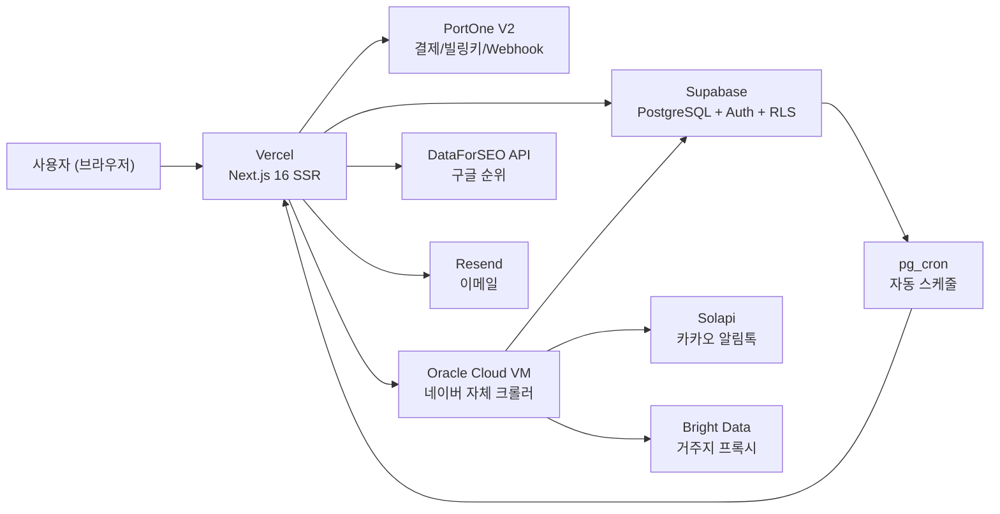
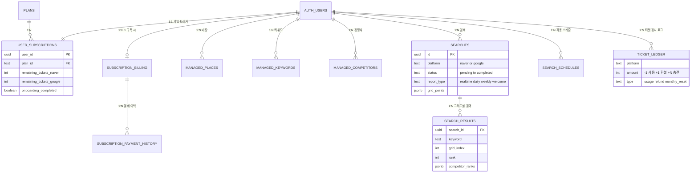
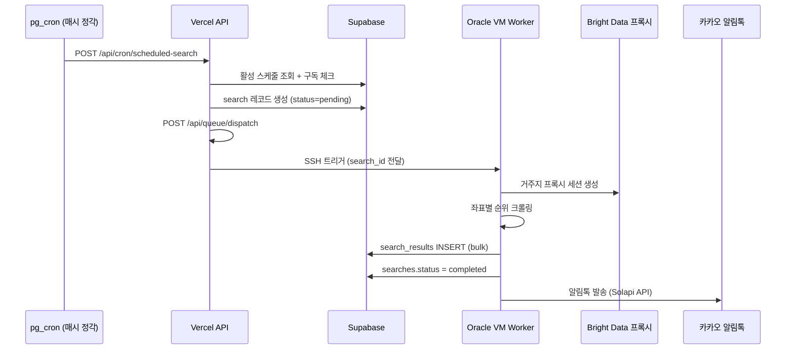

# 맵타민 (Maptamin) — 포트폴리오

---

## 1. 프로젝트 개요

| 항목 | 내용 |
|------|------|
| **서비스명** | 맵타민 (Maptamin) |
| **한 줄 설명** | 상권 내 수십 개 좌표에서 매장의 네이버/구글 플레이스 순위를 측정하고, 지도 위 색상(초록/노랑/빨강)으로 시각화하는 Local SEO SaaS |
| **개발 기간** | 2026.01 ~ 2026.03 (약 3개월) |
| **개발 인원** | 1인 (기획, 디자인, 프론트엔드, 백엔드, 인프라, 운영 전체) |
| **배포 URL** | https://www.maptamin.com (현재 포트폴리오 데모 모드) |
| **테스트 계정 정보** | 아이디: test123@maptamin.com    비밀번호: 123456 |
| **GitHub** | https://github.com/choidev777-bit/maptamin-project |

### 기획 배경

**시작 계기**

실제 구현된 프로젝트만큼 AI 활용 능력을 보여줄 수 있는 것이 없다고 생각해, 어떤 서비스를 만들까 고민하던 중 자주 가는 단골 음식점 사장님이 "장사가 잘 안된다, 마케팅이 너무 어렵다"는 고민을 털어놓으셨습니다. 그 대화에서 높은 진입장벽과 난이도를 가진 지역 마케팅 문제를 직접 해결해보자는 동기가 생겼고, 맵타민 개발을 시작했습니다.

**시장의 문제**

기존 네이버 매장 순위 추적 서비스(애드랭크, 캐치랭크 등)는 "홍대 카페 38위"처럼 **고정된 숫자 하나**만 제공합니다.

하지만 네이버 지도 앱에서 "카페"를 검색하면, **검색자의 GPS 위치에 따라 결과가 완전히 다르게** 나옵니다. 맵타민은 이 문제를 해결합니다:

- 상권 내 수십 개 좌표에서 업종 키워드 순위를 동시에 측정
- 결과를 지도 위 색상으로 시각화 → **어느 동네에서 약한지** 직관적 파악
- "초록불을 늘리세요" 라는 단순한 목표로 마케팅 비전문 사장님도 활용 가능

---

## 2. 기술 스택

| 계층 | 기술 |
|------|------|
| **Frontend** | Next.js 16, React 19, TypeScript, TailwindCSS 4, Radix UI, Recharts, Motion |
| **Backend** | Next.js API Routes (App Router), Supabase (PostgreSQL + Auth + RLS) |
| **결제** | PortOne V2 (빌링키 정기구독 + 일회성 결제 + Webhook) |
| **크롤링 (네이버)** | Oracle Cloud VM + 자체 크롤러 직접 구현 (서드파티 API 미존재), Bright Data 거주지 프록시 세션 로테이션 |
| **크롤링 (구글)** | DataForSEO API |
| **알림** | Solapi (카카오 알림톡), Resend (이메일) |
| **인프라** | Vercel (호스팅), Supabase pg_cron (CRON 스케줄러), Sentry (에러 모니터링) |
| **테스트** | Jest + Testing Library (단위), Playwright (E2E) |
| **지도** | Naver Maps API, Google Maps API |

---

## 3. 시스템 아키텍처

### 3-1. High-Level 아키텍처

### 3-2. 데이터베이스 ERD (주요 테이블)

> 31개 마이그레이션 파일(`supabase/migrations/`)을 직접 리뷰하여 작성

### 3-3. 자동 리포트 시퀀스 다이어그램

---

## 4. 주요 기능

| 기능 | 설명 |
|------|------|
| **플레이스 순위 지도** | 상권 내 좌표별 순위를 초록/노랑/빨강 색상으로 지도에 시각화 |
| **법정경계/행정동 오버레이** | 결과 지도에서 법정경계선을 토글로 표시하고, 좌표 클릭 시 해당 지점의 행정동 정보를 모달에 보여주어 광고 집행 지역 의사결정을 돕도록 구현 |
| **네이버 + 구글 동시 지원** | 네이버 지도, 구글 지도 순위를 하나의 플랫폼에서 분석 |
| **경쟁사 1:1 비교** | 내 매장 vs 경쟁사 순위를 지도 위에서 승패 색상으로 비교 |
| **자동 리포트 + 알림톡** | 선택 요일/시간에 순위 자동 수집, 카카오 알림톡으로 결과 발송 |
| **정기구독 결제** | PortOne V2 빌링키 기반 월간 구독 (시작/해지/해지철회/플랜변경/환불) |
| **티켓 기반 과금** | 실시간 진단 1회 = 티켓 1장 소모 (플랜별 월간 충전 + 추가 구매) |
| **5단계 온보딩** | 구독 → 매장등록 → 키워드등록 → 리포트설정 → 웰컴리포트 자동 생성 |

---

## 5. 배운 점

- **광고 집행 단위를 제품 UX로 연결**: 네이버 지도 자체에는 순위 좌표를 광고 타게팅 지역과 바로 연결해 해석할 수 있는 기능이 없어서, 결과 지도에 법정경계 오버레이와 좌표별 행정동 표시를 직접 구현했습니다. 사용자는 순위가 약한 좌표가 실제로 어느 지역 단위에 속하는지 즉시 파악할 수 있고, 네이버 플레이스 광고의 법정동 기준과 당근 비즈니스 광고의 행정동 기준을 모두 고려해 집행 지역을 더 정확히 선택할 수 있습니다.
- **1인 풀스택 SaaS 운영**: 기획부터 결제 시스템, 크롤링 인프라, 알림톡 발송까지 전체 비즈니스 로직을 혼자 설계·구현·운영한 경험
- **네이버 크롤링 자체 구현**: 구글과 달리 서드파티 API가 없는 네이버에 대해 자체 크롤러를 직접 설계하고, 거주지 프록시 세션 로테이션으로 안정적 데이터 수집을 구현
- **실제 결제 시스템 구현**: PortOne Webhook 멱등성, 빌링키 정기결제, 결제 실패 재시도 패턴 등 **프로덕션 레벨 결제 처리**를 직접 구현
- **자동화 파이프라인 설계**: pg_cron → Vercel API → Oracle VM Worker → 알림톡 발송까지 다중 시스템을 연결하는 **비동기 자동화 파이프라인**
- **DB 스키마 진화 관리**: 포인트 시스템 → 티켓 시스템 전환 등 31개 마이그레이션 파일로 스키마를 점진적 진화시킨 경험

