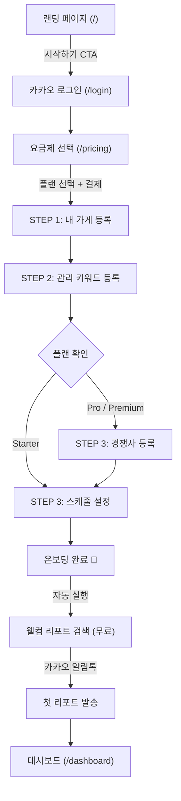
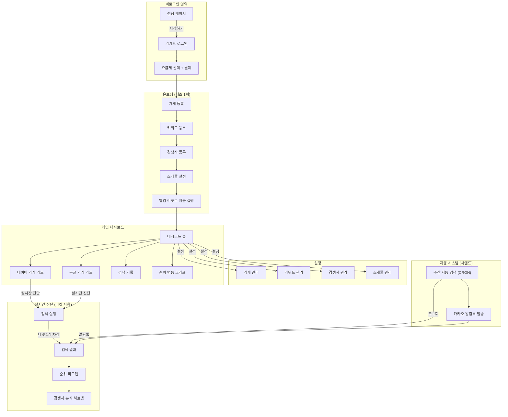
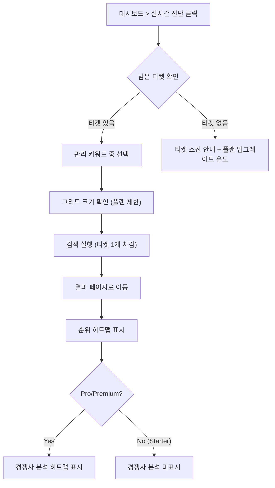
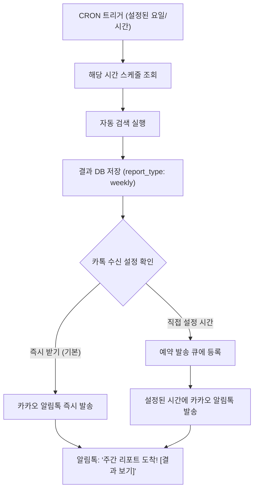

# 맵타민 온보딩 & User Flow 설계

> **Version**: 1.0  
> **Date**: 2026-02-13  
> **기반**: update_plan.md + 사용자 확인 완료 사항

---

## 1. 온보딩 플로우 (신규 사용자)

### 전체 흐름



---

### STEP 1: 내 가게 등록

| 플랜 | 등록 가능 수 | 플랫폼 | 변경 제한 |
|------|-------------|--------|----------|
| Starter | 1곳 | 네이버 | 30일 락 |
| Pro | 1곳 | 네이버 | 30일 락 |
| Premium | 1곳 + 1곳 | 네이버 + 구글 | 락 없음 |

**UI 동작:**
- Starter/Pro: 네이버 지도에서 내 가게 검색 → 선택 → 등록
- Premium: 네이버 가게 등록 화면 → 구글 가게 등록 화면 (2단계)

---

### STEP 2: 관리 키워드 등록

| 플랜 | 키워드 수 | 변경 제한 |
|------|----------|----------|
| Starter | 2개 | 30일 락 |
| Pro | 5개 | 30일 락 |
| Premium | 10개 (네이버 5 + 구글 5) | 30일 락 |

**UI 동작:**
- 키워드 입력 필드 (플랜별 최대 개수 표시)
- "이 키워드는 주간 리포트와 실시간 진단에 모두 사용됩니다" 안내 문구
- "등록 후 30일간 변경이 불가합니다" 경고 표시
- Premium: 네이버 키워드 / 구글 키워드 탭 분리

---

### STEP 3: 경쟁사 등록 (Pro/Premium만)

| 플랜 | 등록 가능 수 | 변경 제한 |
|------|-------------|----------|
| Starter | ❌ 불가 | - |
| Pro | 1곳 | 30일 락 |
| Premium | 최대 10곳 | 30일 락 (일괄) |

> **Premium 일괄 락 규칙**: 경쟁사를 1개라도 등록하면 30일 타이머가 시작됩니다. 30일 후에는 10개 슬롯 전체를 한꺼번에 변경할 수 있습니다. (개별 카운트 X)

**UI 동작:**
- 네이버/구글 지도에서 경쟁사 검색 → 선택
- "등록 후 30일간 변경이 불가합니다" 경고 표시
- 건너뛰기 버튼 (나중에 대시보드에서 등록 가능)

---

### STEP 4: 스케줄 설정

두 가지 시점을 **별개로** 설정합니다:

#### A. 검색 실행 시점
- 요일 선택 (월~일 중 1일)
- 시간 선택 (1시간 단위)
- 예: "매주 월요일 오전 9시에 검색 실행"

#### B. 카카오톡 수신 시점
- ☑️ **"분석 완료 이후 즉시 받아보기"** (기본 체크됨)
- 체크 해제 시:
  - 요일 선택
  - 시간 선택
  - 예: "매주 월요일 오전 10시에 카톡 수신"

---

### 온보딩 완료 → 웰컴 리포트

```
온보딩 완료
    │
    ├── 1. 자동 검색 1회 실행 (무료 보너스, 티켓 미차감)
    │       └── 등록된 가게 + 관리 키워드 + 플랜 그리드 크기 기준
    │
    ├── 2. 검색 완료 후 카카오 알림톡 발송
    │       └── "맵타민 웰컴 리포트가 도착했습니다! [결과 보기]"
    │
    └── 3. 대시보드에 첫 검색 결과 표시
```

---

## 2. 전체 User Flow 다이어그램

### 메인 플로우



---

## 3. 페이지별 상세 User Flow

### 3-1. 대시보드 (`/dashboard`)

```
┌─────────────────────────────────────────────────┐
│  대시보드                                        │
│                                                  │
│  ┌──────────────────┐  ┌──────────────────┐     │
│  │ 🟢 네이버 가게    │  │ 🔵 구글 가게     │     │
│  │ (등록된 가게명)    │  │ (Premium만)      │     │
│  │                   │  │                  │      │
│  │ [실시간 진단]     │  │ [실시간 진단]     │     │
│  │ 남은 티켓: 8/10   │  │ 남은 티켓: 13/15 │     │
│  └──────────────────┘  └──────────────────┘     │
│                                                  │
│  📊 순위 변동 그래프 (주간 리포트 기준)            │
│  ┌──────────────────────────────────────────┐    │
│  │  [키워드1] [키워드2] [키워드3]             │    │
│  │   📈 (recharts 라인 차트)                 │    │
│  └──────────────────────────────────────────┘    │
│                                                  │
│  최근 검색 기록                                   │
│  ┌──────────────────────────────────────────┐    │
│  │  📋 "강남 맛집" - 2/13 09:00 (주간)       │    │
│  │  📋 "강남 카페" - 2/12 14:30 (실시간)      │    │
│  └──────────────────────────────────────────┘    │
└─────────────────────────────────────────────────┘
```

---

### 3-2. 검색 결과 페이지 (`/search/[id]`)

```
┌──────────────────────────────────────────────────┐
│  검색 결과: "강남 맛집"                            │
│                                                   │
│  [키워드1] [키워드2] [키워드3] ← 탭 (첫번째 기본)  │
│                                                   │
│  ┌─ 평균 순위 카드 ─────────────────────────┐     │
│  │  ● 3.2위  최고: 1위  최저: 8위            │     │
│  └──────────────────────────────────────────┘     │
│                                                   │
│  ┌─ 순위 히트맵 (내 가게) ──────────────────┐     │
│  │                                          │     │
│  │   🟢2  🟡5  🟢1                          │     │
│  │   🟡7  🔵●  🟢3                          │     │
│  │   🔴12 🟡6  🟢2                          │     │
│  │                                          │     │
│  │  범례: 🟢1-3위  🟡4-10위  🔴11위~        │     │
│  └──────────────────────────────────────────┘     │
│                                                   │
│  ── 경쟁사 분석 (Pro/Premium만) ──────────────     │
│                                                   │
│  경쟁사: [☕ 스타벅스 강남점 ▼] ← 드롭다운         │
│  (Pro: 드롭다운 없이 자동 표시)                    │
│                                                   │
│  ┌─ 경쟁사 비교 히트맵 ────────────────────┐      │
│  │                                          │     │
│  │   🟢승  🔴패  🟢승                       │     │
│  │   🔴패  🔵●  🟢승                        │     │
│  │   🟢승  🟢승  🔴패                       │     │
│  │                                          │     │
│  │  범례: 🟢 승리  🔴 패배                   │     │
│  │  클릭 → "내 가게: 2위 / 스타벅스: 5위"    │     │
│  └──────────────────────────────────────────┘     │
└──────────────────────────────────────────────────┘
```

---

### 3-3. 설정 페이지 (`/settings`)

```
┌──────────────────────────────────────────────────┐
│  설정                                             │
│                                                   │
│  ┌─ 내 가게 관리 ──────────────────────────┐      │
│  │  네이버: 강남맛집A  (변경: 2/28 이후)    │      │
│  │  구글: Gangnam A    (Premium: 즉시 변경) │      │
│  └──────────────────────────────────────────┘     │
│                                                   │
│  ┌─ 관리 키워드 ───────────────────────────┐      │
│  │  1. 강남 맛집    🔒 변경: 3/15 이후      │      │
│  │  2. 강남 카페    🔒 변경: 3/15 이후      │      │
│  │  + 키워드 추가 (0/5 남음)                │      │
│  └──────────────────────────────────────────┘     │
│                                                   │
│  ┌─ 경쟁사 관리 (Pro/Premium) ─────────────┐      │
│  │  1. 스타벅스 강남점  🔒 변경: 3/15 이후  │      │
│  │  + 경쟁사 추가 (0/1 남음)                │      │
│  │  ⚠️ 30일 후 전체 슬롯 일괄 변경 가능     │      │
│  └──────────────────────────────────────────┘     │
│                                                   │
│  ┌─ 스케줄 설정 ───────────────────────────┐      │
│  │  🔍 검색 실행: 매주 월요일 09:00          │      │
│  │  📱 카톡 수신: ☑️ 분석 완료 즉시 받기     │      │
│  │              ☐ 직접 설정 (요일/시간)      │      │
│  └──────────────────────────────────────────┘     │
│                                                   │
│  ┌─ 계정 ─────────────────────────────────┐       │
│  │  플랜: Pro (29,000원/월)                │       │
│  │  [플랜 변경]  [회원 탈퇴]               │       │
│  └──────────────────────────────────────────┘     │
└──────────────────────────────────────────────────┘
```

---

## 4. 실시간 진단 티켓 사용 Flow



---

## 5. 자동 주간 리포트 Flow



---

## 6. 플랜별 기능 접근 권한 요약

| 기능 | Starter | Pro | Premium |
|------|---------|-----|---------|
| 대시보드 | ✅ | ✅ | ✅ |
| 네이버 가게 등록 | ✅ (1곳, 30일 락) | ✅ (1곳, 30일 락) | ✅ (1곳, 락 없음) |
| 구글 가게 등록 | ❌ | ❌ | ✅ (1곳, 락 없음) |
| 관리 키워드 | 2개 (30일 락) | 5개 (30일 락) | 10개 (5+5, 30일 락) |
| 그리드 크기 | 3×3 (9지점) | 5×5 (25지점) | 7×7 (49지점) |
| 실시간 진단 티켓 | 2개/월 | 10개/월 | 30개/월 (15+15) |
| 경쟁사 등록 | ❌ | 1곳 (30일 락) | 10곳 (30일 락, 일괄) |
| 경쟁사 분석 히트맵 | ❌ | ✅ (드롭다운 없음) | ✅ (드롭다운) |
| 주간 리포트 (카톡) | ✅ | ✅ | ✅ |
| 웰컴 리포트 | ✅ (무료) | ✅ (무료) | ✅ (무료) |
| 순위 변동 그래프 | ✅ | ✅ | ✅ |
| 스케줄 설정 | ✅ | ✅ | ✅ |

---

## 7. URL 구조 (제안)

| URL | 페이지 | 비고 |
|-----|--------|------|
| `/` | 랜딩 페이지 | 비로그인 |
| `/login` | 카카오 로그인 | 비로그인 |
| `/pricing` | 요금제 상세 | 비로그인 |
| `/onboarding` | 온보딩 위저드 | 결제 후 최초 1회 |
| `/dashboard` | 대시보드 홈 | 로그인 필수 |
| `/search/[id]` | 구글 검색 결과 | 로그인 필수 |
| `/naver-search/[id]` | 네이버 검색 결과 | 로그인 필수 |
| `/settings` | 설정 (가게/키워드/경쟁사/스케줄) | 로그인 필수 |

---

## 8. 핵심 비즈니스 규칙 체크리스트

- [ ] 무료 체험 없음 → 랜딩에서 "무료" 관련 문구 제거
- [ ] 웰컴 리포트는 티켓 미차감 (무료 보너스)
- [ ] 실시간 진단은 **관리 키워드만** 사용 가능
- [ ] 주간 리포트 데이터만 순위 변동 그래프에 포함 (실시간 진단 결과 제외)
- [ ] 경쟁사 분석: 추가 크롤링 없이 기존 `competitors` 데이터 활용
- [ ] Pro: 경쟁사 1곳 → 드롭다운 없이 자동 표시
- [ ] Premium: 경쟁사 최대 10곳 → 첫 번째 경쟁사 기본 선택, 드롭다운 전환
- [ ] 검색 결과의 키워드 탭: 첫 번째 키워드 기본 선택
- [ ] 스케줄: 검색 시점 ≠ 카톡 수신 시점 (별개 설정)
- [ ] 카톡 수신: "분석 완료 즉시 받기"가 기본값
- [ ] 가게/키워드/경쟁사: 30일 락 (Premium 가게만 락 없음)
- [ ] Premium 경쟁사 일괄 락: 1개라도 등록 시 30일 타이머 시작, 30일 후 전체 슬롯 일괄 변경
